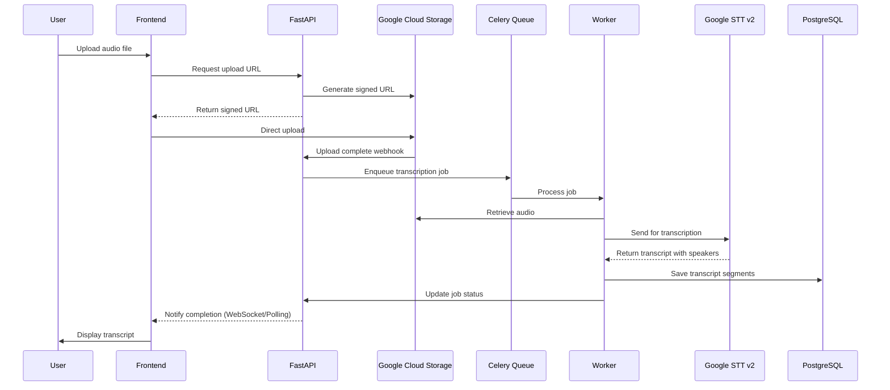

# AI Audio Transcription Feature Design

## Executive Summary

Audio-to-transcript conversion service for coaching sessions, providing high-quality transcription with speaker diarization using Google Speech-to-Text v2.

## Core Requirements

### Functional Requirements
- **FR-01**: Upload audio files (≤ 120 min, ≤ 1 GB)
- **FR-02**: Automatic speech-to-text conversion with speaker diarization
- **FR-03**: Export formats: JSON, VTT, SRT
- **FR-04**: Automatic speaker role detection (Coach/Client)
- **FR-05**: Manual speaker role override option
- **FR-06**: Multi-language support (zh-TW priority, then zh-CN, en)

### Non-Functional Requirements
- **NFR-01**: Processing time ≤ 4× audio duration (P95)
- **NFR-02**: Auto-delete audio files after configurable period (default: 24 hours)
- **NFR-03**: Support concurrent processing for multiple users
- **NFR-04**: Comprehensive audit logging for all operations
- **NFR-05**: Provider-agnostic STT architecture

## System Architecture



## Technical Implementation

### 1. Audio Upload Service

```python
# apps/api-server/src/services/upload_service.py
from google.cloud import storage
from typing import Dict, Tuple
import uuid
from datetime import datetime, timedelta

class AudioUploadService:
    def __init__(self, bucket_name: str):
        self.storage_client = storage.Client()
        self.bucket = self.storage_client.bucket(bucket_name)
    
    def generate_upload_url(
        self, 
        session_id: str, 
        file_extension: str,
        content_type: str = "audio/mpeg"
    ) -> Tuple[str, str]:
        """Generate signed URL for direct client upload"""
        blob_name = f"sessions/{session_id}/{uuid.uuid4()}.{file_extension}"
        blob = self.bucket.blob(blob_name)
        
        url = blob.generate_signed_url(
            version="v4",
            expiration=timedelta(minutes=30),
            method="PUT",
            content_type=content_type,
        )
        
        return url, blob_name

    def set_lifecycle_policy(self, retention_days: int = None):
        """Set auto-deletion policy for GDPR compliance"""
        from config import settings
        
        days = retention_days or settings.AUDIO_RETENTION_DAYS  # Configurable, default 1
        lifecycle_rule = {
            'action': {'type': 'Delete'},
            'condition': {'age': days}
        }
        self.bucket.add_lifecycle_delete_rule(age=days)
        self.bucket.patch()
        
        # Log the policy setting for audit
        logging.info(f"Set lifecycle policy: delete after {days} days")
```

### 2. STT Provider Abstraction Layer

```python
# apps/api-server/src/services/stt/base.py
from abc import ABC, abstractmethod
from typing import List, Dict, Optional
from dataclasses import dataclass

@dataclass
class TranscriptSegment:
    speaker_id: int
    content: str
    start_sec: float
    end_sec: float
    confidence: Optional[float] = None

class STTProvider(ABC):
    """Abstract base class for STT providers"""
    
    @abstractmethod
    async def transcribe(
        self, 
        audio_uri: str, 
        language: str = "zh-TW",
        enable_diarization: bool = True
    ) -> List[TranscriptSegment]:
        """Transcribe audio and return segments"""
        pass
    
    @abstractmethod
    def estimate_cost(self, duration_seconds: int) -> float:
        """Estimate transcription cost in USD"""
        pass

# apps/api-server/src/services/stt/google_stt.py
class GoogleSTTProvider(STTProvider):
    """Google Speech-to-Text v2 implementation"""
    
    COST_PER_MINUTE = 0.016  # USD
    
    def __init__(self):
        from google.cloud import speech_v2
        self.client = speech_v2.SpeechClient()
    
    async def transcribe(
        self, 
        audio_uri: str, 
        language: str = "zh-TW",
        enable_diarization: bool = True
    ) -> List[TranscriptSegment]:
        # Implementation details...
        pass
    
    def estimate_cost(self, duration_seconds: int) -> float:
        return (duration_seconds / 60) * self.COST_PER_MINUTE

# apps/api-server/src/services/stt/whisper_stt.py  
class WhisperSTTProvider(STTProvider):
    """OpenAI Whisper API implementation (future)"""
    
    COST_PER_MINUTE = 0.006  # USD
    
    async def transcribe(
        self, 
        audio_uri: str, 
        language: str = "zh-TW",
        enable_diarization: bool = True
    ) -> List[TranscriptSegment]:
        # Future implementation
        # Will need to download file from GCS
        # Use pyannote for diarization if enabled
        raise NotImplementedError("Whisper provider coming soon")
    
    def estimate_cost(self, duration_seconds: int) -> float:
        return (duration_seconds / 60) * self.COST_PER_MINUTE

# apps/api-server/src/services/stt/factory.py
from typing import Literal
from config import settings

class STTProviderFactory:
    """Factory for creating STT provider instances"""
    
    @staticmethod
    def create(provider_type: Literal["google", "whisper"] = None) -> STTProvider:
        provider = provider_type or settings.DEFAULT_STT_PROVIDER
        
        if provider == "google":
            return GoogleSTTProvider()
        elif provider == "whisper":
            return WhisperSTTProvider()
        else:
            raise ValueError(f"Unknown STT provider: {provider}")
```

### 3. Transcription Worker

```python
# apps/api-server/src/workers/transcription_worker.py
from celery import Task
from google.cloud import speech_v2
from typing import List, Dict
import logging

class TranscriptionTask(Task):
    def __init__(self):
        self.stt_client = speech_v2.SpeechClient()
        
    def run(self, session_id: str, gcs_uri: str, language: str = "zh-TW"):
        """Process audio file and generate transcript"""
        try:
            # Configure STT request
            config = speech_v2.RecognitionConfig(
                encoding=speech_v2.RecognitionConfig.AudioEncoding.MP3,
                language_code=language,
                enable_speaker_diarization=True,
                diarization_config=speech_v2.SpeakerDiarizationConfig(
                    enable_speaker_diarization=True,
                    min_speaker_count=2,
                    max_speaker_count=4,
                ),
                enable_automatic_punctuation=True,
                model="long",
            )
            
            audio = speech_v2.RecognitionAudio(uri=gcs_uri)
            
            # Long-running operation
            operation = self.stt_client.long_running_recognize(
                config=config, 
                audio=audio
            )
            
            # Wait for completion
            response = operation.result(timeout=3600)
            
            # Process results
            segments = self._process_transcript(response)
            
            # Save to database
            self._save_segments(session_id, segments)
            
            # Update job status
            self._update_status(session_id, "completed")
            
            return {"status": "success", "segments": len(segments)}
            
        except Exception as e:
            logging.error(f"Transcription failed for {session_id}: {str(e)}")
            self._update_status(session_id, "failed", error=str(e))
            raise

    def _process_transcript(self, response) -> List[Dict]:
        """Convert STT response to structured segments"""
        segments = []
        
        for result in response.results:
            # Group words by speaker
            current_speaker = None
            current_segment = {"words": [], "start_time": None, "end_time": None}
            
            for word_info in result.alternatives[0].words:
                speaker_tag = word_info.speaker_tag
                
                if speaker_tag != current_speaker:
                    if current_segment["words"]:
                        segments.append({
                            "speaker_id": current_speaker,
                            "content": " ".join(current_segment["words"]),
                            "start_sec": current_segment["start_time"],
                            "end_sec": current_segment["end_time"]
                        })
                    
                    current_speaker = speaker_tag
                    current_segment = {
                        "words": [word_info.word],
                        "start_time": word_info.start_time.total_seconds(),
                        "end_time": word_info.end_time.total_seconds()
                    }
                else:
                    current_segment["words"].append(word_info.word)
                    current_segment["end_time"] = word_info.end_time.total_seconds()
            
            # Add last segment
            if current_segment["words"]:
                segments.append({
                    "speaker_id": current_speaker,
                    "content": " ".join(current_segment["words"]),
                    "start_sec": current_segment["start_time"],
                    "end_sec": current_segment["end_time"]
                })
        
        return segments
```

### 4. Speaker Role Detection Service

```python
# apps/api-server/src/services/speaker_detection.py
from typing import List, Dict, Tuple
import re
from collections import Counter

class SpeakerRoleDetector:
    """Automatically detect coach vs client based on speech patterns"""
    
    # Coaching-specific keywords and patterns
    COACH_INDICATORS = [
        # Questions patterns (coaches ask more questions)
        r"你覺得.*?",
        r"你認為.*?", 
        r"你想.*?",
        r"什麼.*?",
        r"如何.*?",
        r"為什麼.*?",
        r"能不能.*?",
        r"可以.*嗎",
        
        # Coaching language
        r"我聽到.*",
        r"我注意到.*",
        r"讓我們.*",
        r"試著.*",
        r"探索.*",
        r"反思.*",
        
        # Permission and acknowledgment
        r"很好.*",
        r"非常好.*",
        r"我理解.*",
        r"我明白.*",
    ]
    
    CLIENT_INDICATORS = [
        # Self-referential statements
        r"我的.*",
        r"我是.*",
        r"我有.*",
        r"我想要.*",
        r"我希望.*",
        
        # Problem statements
        r"我不知道.*",
        r"我擔心.*",
        r"我害怕.*",
        r"困難.*",
        r"問題是.*",
    ]
    
    def detect_roles(
        self, 
        segments: List[Dict],
        confidence_threshold: float = 0.6
    ) -> Tuple[Dict[int, str], float]:
        """
        Detect speaker roles based on speech patterns
        
        Returns:
            roles: Dict mapping speaker_id to role
            confidence: Detection confidence score
        """
        speaker_scores = {}
        
        # Analyze each speaker's patterns
        for segment in segments:
            speaker_id = segment["speaker_id"]
            content = segment["content"]
            
            if speaker_id not in speaker_scores:
                speaker_scores[speaker_id] = {
                    "coach_score": 0,
                    "client_score": 0,
                    "total_words": 0,
                    "question_count": 0,
                    "statement_count": 0
                }
            
            # Count questions vs statements
            if "?" in content or "嗎" in content or "呢" in content:
                speaker_scores[speaker_id]["question_count"] += 1
            else:
                speaker_scores[speaker_id]["statement_count"] += 1
            
            # Check coach indicators
            for pattern in self.COACH_INDICATORS:
                if re.search(pattern, content):
                    speaker_scores[speaker_id]["coach_score"] += 1
            
            # Check client indicators  
            for pattern in self.CLIENT_INDICATORS:
                if re.search(pattern, content):
                    speaker_scores[speaker_id]["client_score"] += 1
            
            # Track total words
            speaker_scores[speaker_id]["total_words"] += len(content)
        
        # Determine roles based on scores
        roles = {}
        confidence_scores = []
        
        for speaker_id, scores in speaker_scores.items():
            # Calculate ratios
            question_ratio = scores["question_count"] / max(
                scores["question_count"] + scores["statement_count"], 1
            )
            
            # Coaches typically ask more questions (>40%)
            coach_likelihood = (
                scores["coach_score"] * 2 +  # Weight coach patterns higher
                question_ratio * 10  # Questions are strong indicator
            )
            
            client_likelihood = scores["client_score"]
            
            # Assign role based on likelihood
            if coach_likelihood > client_likelihood:
                roles[speaker_id] = "Coach"
                confidence = coach_likelihood / (coach_likelihood + client_likelihood + 1)
            else:
                roles[speaker_id] = "Client"
                confidence = client_likelihood / (coach_likelihood + client_likelihood + 1)
            
            confidence_scores.append(confidence)
        
        # Calculate overall confidence
        avg_confidence = sum(confidence_scores) / len(confidence_scores) if confidence_scores else 0
        
        # If confidence is too low, return None to indicate manual assignment needed
        if avg_confidence < confidence_threshold:
            return None, avg_confidence
        
        # Ensure we have exactly one coach and one client for 2-speaker sessions
        if len(roles) == 2:
            role_counts = Counter(roles.values())
            if role_counts["Coach"] != 1 or role_counts["Client"] != 1:
                # Adjust based on question ratio if both detected as same role
                speakers = list(speaker_scores.keys())
                q_ratios = [
                    speaker_scores[s]["question_count"] / 
                    max(speaker_scores[s]["question_count"] + speaker_scores[s]["statement_count"], 1)
                    for s in speakers
                ]
                
                # Speaker with higher question ratio is coach
                if q_ratios[0] > q_ratios[1]:
                    roles[speakers[0]] = "Coach"
                    roles[speakers[1]] = "Client"
                else:
                    roles[speakers[0]] = "Client"
                    roles[speakers[1]] = "Coach"
        
        return roles, avg_confidence

# Usage in transcription worker
def process_and_detect_roles(segments: List[Dict]) -> Dict:
    detector = SpeakerRoleDetector()
    roles, confidence = detector.detect_roles(segments)
    
    if roles:
        # Auto-detected with sufficient confidence
        logging.info(f"Auto-detected roles with {confidence:.2%} confidence")
        return {
            "segments": segments,
            "speaker_roles": roles,
            "detection_confidence": confidence,
            "detection_method": "automatic"
        }
    else:
        # Need manual assignment
        logging.info(f"Low confidence ({confidence:.2%}), manual assignment needed")
        return {
            "segments": segments,
            "speaker_roles": None,
            "detection_confidence": confidence,
            "detection_method": "manual_required"
        }
```

### 5. Export Service

```python
# apps/api-server/src/services/export_service.py
from typing import List, Dict
import json
from datetime import timedelta

class TranscriptExportService:
    @staticmethod
    def to_vtt(segments: List[Dict], speaker_roles: Dict[int, str]) -> str:
        """Export transcript as WebVTT format"""
        vtt_lines = ["WEBVTT", ""]
        
        for i, segment in enumerate(segments):
            start = TranscriptExportService._format_timestamp(segment["start_sec"])
            end = TranscriptExportService._format_timestamp(segment["end_sec"])
            speaker = speaker_roles.get(segment["speaker_id"], f"Speaker {segment['speaker_id']}")
            
            vtt_lines.append(f"{i+1}")
            vtt_lines.append(f"{start} --> {end}")
            vtt_lines.append(f"<v {speaker}>{segment['content']}")
            vtt_lines.append("")
        
        return "\n".join(vtt_lines)
    
    @staticmethod
    def to_srt(segments: List[Dict], speaker_roles: Dict[int, str]) -> str:
        """Export transcript as SRT format"""
        srt_lines = []
        
        for i, segment in enumerate(segments):
            start = TranscriptExportService._format_srt_timestamp(segment["start_sec"])
            end = TranscriptExportService._format_srt_timestamp(segment["end_sec"])
            speaker = speaker_roles.get(segment["speaker_id"], f"Speaker {segment['speaker_id']}")
            
            srt_lines.append(str(i+1))
            srt_lines.append(f"{start} --> {end}")
            srt_lines.append(f"[{speaker}] {segment['content']}")
            srt_lines.append("")
        
        return "\n".join(srt_lines)
    
    @staticmethod
    def _format_timestamp(seconds: float) -> str:
        """Format seconds to HH:MM:SS.mmm"""
        td = timedelta(seconds=seconds)
        hours = td.seconds // 3600
        minutes = (td.seconds % 3600) // 60
        seconds = td.seconds % 60
        milliseconds = td.microseconds // 1000
        return f"{hours:02d}:{minutes:02d}:{seconds:02d}.{milliseconds:03d}"
```

## API Endpoints

### 1. Create Transcription Session
```http
POST /api/v1/sessions
Authorization: Bearer {jwt_token}
Content-Type: application/json

{
  "title": "Coaching Session 2025-01-09",
  "language": "zh-TW"
}

Response:
{
  "session_id": "uuid",
  "upload_url": "https://storage.googleapis.com/...",
  "expires_at": "2025-01-09T10:30:00Z"
}
```

### 2. Check Transcription Status
```http
GET /api/v1/sessions/{session_id}/status

Response:
{
  "status": "processing|completed|failed",
  "progress": 75,
  "estimated_completion": "2025-01-09T10:15:00Z"
}
```

### 3. Assign Speaker Roles
```http
PATCH /api/v1/sessions/{session_id}/speakers
Content-Type: application/json

{
  "speaker_roles": {
    "1": "Coach",
    "2": "Client"
  }
}
```

### 4. Export Transcript
```http
GET /api/v1/sessions/{session_id}/export?format=vtt

Response: (WebVTT file)
WEBVTT

1
00:00:00.000 --> 00:00:05.000
<v Coach>歡迎來到今天的教練會談...
```

## Database Schema

```sql
-- Sessions table
CREATE TABLE sessions (
    id UUID PRIMARY KEY DEFAULT gen_random_uuid(),
    user_id UUID REFERENCES users(id),
    title VARCHAR(255),
    audio_url TEXT,
    language VARCHAR(10) DEFAULT 'zh-TW',
    status VARCHAR(20) DEFAULT 'pending',
    duration_seconds INTEGER,
    created_at TIMESTAMP DEFAULT CURRENT_TIMESTAMP,
    completed_at TIMESTAMP
);

-- Transcript segments table  
CREATE TABLE transcript_segments (
    id UUID PRIMARY KEY DEFAULT gen_random_uuid(),
    session_id UUID REFERENCES sessions(id) ON DELETE CASCADE,
    speaker_id INTEGER,
    speaker_role VARCHAR(20),
    start_seconds DECIMAL(10,3),
    end_seconds DECIMAL(10,3),
    content TEXT,
    confidence DECIMAL(3,2),
    created_at TIMESTAMP DEFAULT CURRENT_TIMESTAMP
);

-- Indexes for performance
CREATE INDEX idx_segments_session ON transcript_segments(session_id);
CREATE INDEX idx_segments_timeline ON transcript_segments(session_id, start_seconds);
```

## Work Breakdown Structure

### Phase 1: Infrastructure Setup (2-3 days)
- [ ] Set up Google Cloud Storage bucket with lifecycle rules
- [ ] Configure Google Speech-to-Text v2 API credentials
- [ ] Set up Celery with Redis for task queue
- [ ] Implement database models with SQLAlchemy

### Phase 2: Upload Service (2 days)
- [ ] Implement signed URL generation for GCS
- [ ] Create upload API endpoint
- [ ] Add file validation (size, format, duration)
- [ ] Implement upload progress tracking

### Phase 3: Transcription Worker (3-4 days)
- [ ] Implement STT client wrapper
- [ ] Create Celery task for transcription
- [ ] Implement speaker diarization processing
- [ ] Add error handling and retry logic
- [ ] Create progress reporting mechanism

### Phase 4: Export & Display (2 days)
- [ ] Implement VTT/SRT export functions
- [ ] Create export API endpoints
- [ ] Add speaker role assignment endpoint
- [ ] Implement transcript segment merging logic

### Phase 5: Frontend Integration (3 days)
- [ ] Create audio upload component
- [ ] Implement progress tracking UI
- [ ] Build transcript viewer with speaker labels
- [ ] Add speaker role assignment UI
- [ ] Implement export download functionality

### Phase 6: Testing & Optimization (2 days)
- [ ] Unit tests for all services
- [ ] Integration tests for full workflow
- [ ] Performance testing with various audio sizes
- [ ] Error handling and edge cases

## Design Decisions & Rationale

### 1. STT Provider Strategy
**Decision**: Implement abstraction layer with Google STT as default
- Start with Google Speech-to-Text v2 for native diarization
- Provider abstraction allows future addition of Whisper
- POC needed to compare accuracy for Traditional Chinese
- Configuration-based provider switching for A/B testing

### 2. File Storage Policy
**Decision**: Configurable retention with 24-hour default
- Default 24-hour deletion for GDPR compliance
- Clear warning message on upload interface
- Future: Extended retention for premium tiers
- No re-processing after deletion (clear user communication)

### 3. Processing Limits
**Decision**: 2-hour maximum per file
- Single file limit: 120 minutes
- Reject files exceeding limit (clear error message)
- Future: Premium tiers with extended limits
- No automatic splitting (maintain session integrity)

### 4. Speaker Identification
**Decision**: Automatic detection with manual override
- Auto-detect coach vs client using speech patterns
- Question frequency as primary indicator
- Coaching language patterns as secondary signals
- Manual override always available
- Currently: 2-speaker sessions only
- Future: Multi-party support for group coaching

### 5. Language Support
**Decision**: Manual selection with auto-detect (beta)
- Priority: zh-TW → zh-CN → en
- Manual language selection required
- Auto-detection marked as "beta" feature
- Mixed language defaults to primary selection
- Future: True multilingual support

### 6. Processing Architecture
**Decision**: Batch processing only
- Async processing via Celery queue
- Status updates via polling (simpler infrastructure)
- Real-time streaming is future work
- Future: Priority queues for premium tiers

### 7. Cost Management
**Future Work**: Separate cost optimization document needed
- Usage quotas require cost modeling
- File deduplication via hash checking
- Audio compression before processing
- Batch processing for cost efficiency

### 8. Privacy & Security
**Decision**: Compliance-first approach
- TLS encryption in transit (not E2E initially)
- Mandatory 24-hour deletion (no permanent storage)
- Comprehensive audit logging required
- **E2E Encryption**: Audio encrypted at rest and in transit, but not end-to-end initially (server needs to process)
- **Future Work**: Separate audit log design document needed

## Success Metrics

1. **Performance**
   - P95 processing time < 4× audio duration
   - Upload success rate > 99%
   - Transcription accuracy > 90%

2. **Cost**
   - STT cost per minute < $0.02
   - Storage cost per user < $0.10/month
   - Infrastructure cost < $15/month base

3. **User Experience**
   - Time to first transcript < 5 minutes
   - Speaker identification accuracy > 95%
   - Export generation < 2 seconds

## Risk Mitigation

| Risk | Impact | Mitigation |
|------|--------|------------|
| STT API quota exceeded | Service unavailable | Implement rate limiting, queue management |
| Large file uploads fail | Poor UX | Chunked upload, resume capability |
| Speaker diarization inaccurate | Manual correction needed | Provide easy editing interface |
| Cost overrun | Business impact | Usage monitoring, alerts, quotas |
| Data breach | Legal/reputation | Encryption, access controls, audit logs |

## Next Steps

1. **Immediate Actions**
   - Set up GCP project and enable APIs
   - Create development environment with docker-compose
   - Implement basic upload → transcribe → export flow

2. **Validation**
   - Test with real coaching session recordings
   - Validate speaker diarization accuracy
   - Benchmark processing times

3. **Iteration**
   - Gather user feedback on transcript quality
   - Optimize based on actual usage patterns
   - Consider additional features based on demand