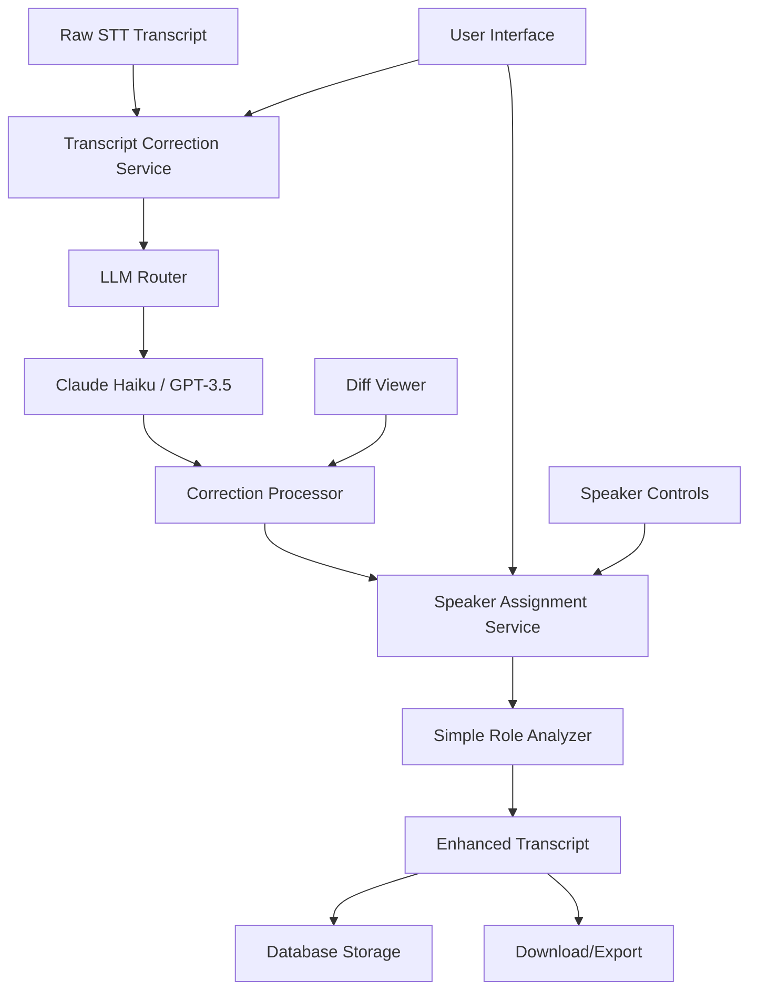

# Epic 1: Smart Transcript Enhancement

## Epic Overview

**Epic ID**: EPIC-1  
**Priority**: High (Phase 1 - Foundation)  
**Duration**: 3 months (Months 1-3)  
**Business Value**: Foundation for all AI Coach features  

## Epic Statement

**As coaches using the platform, we want intelligent transcript processing so that we can focus on coaching insights rather than manual transcript cleanup.**

## Value Proposition

Transform raw, error-prone STT output into professional, readable coaching session transcripts that meet certification standards and enable advanced AI analysis.

### Business Impact
- **Time Savings**: 25+ minutes saved per session in manual review
- **Professional Quality**: All transcripts meet coaching certification standards  
- **Foundation**: Enables $50K+ revenue from downstream AI features
- **User Satisfaction**: Addresses #1 user pain point (transcript quality)

## User Stories

### 📝 [User Story 1.1: Automatic Transcript Correction](./user-story-1.1-auto-correct.md)
**Story**: *"As a coach, I want my raw transcripts automatically corrected so that I can focus on coaching insights rather than fixing typos."*

**Key Features**:
- One-click transcript correction
- Before/after diff viewer
- Individual change accept/reject
- Professional formatting output

**Success Criteria**: 90% accuracy, <30s processing, 85% user acceptance

---

### 👥 [User Story 1.2: Intelligent Speaker Assignment](./user-story-1.2-speaker-assignment.md)
**Story**: *"As a coach, I want speaker diarization errors automatically fixed so that conversation flow is clear and professional."*

**Key Features**:
- Auto-detect coach vs client roles
- Confidence scoring system
- Manual override with drag-and-drop
- Bulk speaker reassignment

**Success Criteria**: 95% accuracy, High confidence 80% of time

## Epic Success Metrics

### Quantitative KPIs
| Metric | Target | Measurement |
|--------|---------|-------------|
| **Processing Speed** | <30 seconds | Average correction time |
| **Accuracy Rate** | 90%+ | vs Human validation |
| **User Adoption** | 75% | Users who try auto-correct |
| **Feature Stickiness** | 90% | Regular usage after first use |
| **Cost Efficiency** | <$0.25 | Per transcript correction |

### Qualitative Indicators
- **User Feedback**: NPS >8 for transcript quality
- **Professional Standards**: Transcripts meet ICF certification requirements
- **Support Reduction**: <2% require manual intervention
- **Workflow Integration**: Seamless with existing session management

## Technical Architecture

### Component Overview


### Key Services
1. **LLM Router Service**: Multi-provider abstraction layer
2. **Transcript Correction Service**: Grammar, punctuation, formatting fixes
3. **Speaker Assignment Service**: Coach/client role identification
4. **Diff Generation**: Before/after change visualization
5. **Export Service**: Professional transcript formatting

### Database Schema
```sql
-- Core transcript processing
sessions (existing)
├── transcript_corrections
│   ├── correction_id (PK)
│   ├── session_id (FK)
│   ├── provider_used
│   ├── processing_time_ms
│   └── cost_usd
├── correction_changes
│   ├── correction_id (FK)
│   ├── original_text
│   ├── corrected_text
│   └── user_action
└── speaker_assignments
    ├── analysis_id (PK)
    ├── session_id (FK)
    ├── speaker_id
    ├── assigned_role
    └── confidence_score
```

## Implementation Timeline

### Month 1: Foundation Infrastructure
**Week 1-2**: LLM Integration Framework
- [ ] LLM Router Service setup
- [ ] Provider abstraction (OpenAI, Anthropic)
- [ ] Cost tracking and monitoring
- [ ] Basic error handling and retries

**Week 3-4**: Transcript Correction Core
- [ ] Correction prompt engineering
- [ ] Processing pipeline implementation
- [ ] Diff generation algorithm
- [ ] Database schema and APIs

### Month 2: User Interface & Speaker Analysis
**Week 1-2**: Correction UI Components
- [ ] Auto-correct button integration
- [ ] Processing indicators and feedback
- [ ] Diff viewer component
- [ ] Accept/reject control interface

**Week 3-4**: Speaker Assignment System
- [ ] Simple role assignment algorithm
- [ ] Speaker statistics calculation
- [ ] Manual override interface
- [ ] Bulk assignment updates

### Month 3: Quality Assurance & Launch
**Week 1-2**: Testing & Optimization
- [ ] Accuracy validation with human experts
- [ ] Performance optimization
- [ ] Edge case handling
- [ ] User acceptance testing

**Week 3-4**: Production Launch
- [ ] Feature flag implementation
- [ ] Gradual rollout to beta users
- [ ] Monitoring and analytics setup
- [ ] User documentation and support

## Dependencies & Prerequisites

### Technical Dependencies
- ✅ **Session Management**: Existing transcript storage system
- ✅ **File Processing**: Current STT pipeline integration
- 🔧 **LLM Providers**: API access and cost management
- 🔧 **UI Framework**: Frontend components for diff viewing

### Business Dependencies
- **Legal Review**: AI processing disclaimers and user consent
- **Pricing Strategy**: Cost absorption vs pass-through model
- **Support Training**: Customer success team education
- **User Communication**: Feature announcement and onboarding

## Risk Assessment

### High-Priority Risks
| Risk | Impact | Probability | Mitigation |
|------|---------|-------------|------------|
| **LLM Accuracy Below Target** | High | Medium | Extensive prompt engineering + human validation |
| **Processing Performance** | Medium | Low | Early performance testing + optimization |
| **User Adoption Resistance** | High | Low | Conservative approach + user control |

### Monitoring & Alerts
- **Processing Time**: Alert if >45 seconds average
- **Accuracy Degradation**: Alert if <85% vs validation set
- **Cost Overrun**: Alert if >$0.35 per correction
- **Error Rate**: Alert if >5% processing failures

## Success Criteria & Exit Conditions

### Epic Completion ✅
- [ ] Both user stories delivered and validated
- [ ] All acceptance criteria met with user testing
- [ ] Performance benchmarks consistently achieved
- [ ] Production deployment successful with monitoring

### Go/No-Go for Phase 2
- ✅ **User Adoption**: 60%+ of active users try auto-correction
- ✅ **Quality**: 90%+ accuracy maintained over 2 weeks
- ✅ **Performance**: <30s average processing time
- ✅ **Business**: Cost model validated and sustainable

### Success Indicators
- **User Feedback**: "This saves me 20+ minutes per session"
- **Professional Quality**: Transcripts accepted for ICF portfolios
- **Foundation Ready**: Technical architecture supports Epic 2 features
- **Market Validation**: Justifies Pro tier pricing increase

---

## Navigation

**📋 Epic Planning**: [Implementation Roadmap](../../implementation-roadmap.md)  
**🎯 User Stories**: [All AI Coach User Stories](../../user-stories.md)  
**🔧 Technical Specs**: [Transcript Correction Workflow](../../technical/workflows/transcript-correction.md)  
**📈 Next Phase**: [Epic 2: ICF Competency Analysis](../epic2-icf-analysis/README.md)