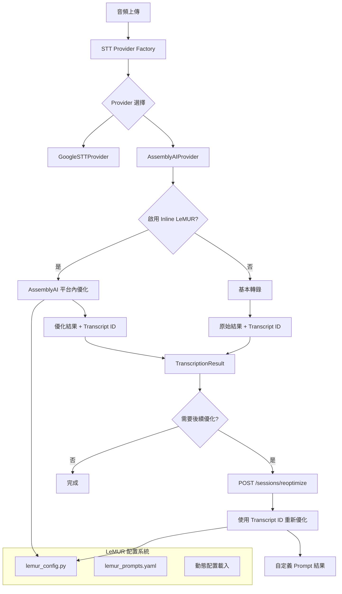

# LeMUR 雙軌制優化架構

## 概述

本文件描述 AssemblyAI LeMUR 整合的雙軌制架構設計，旨在提供高效能的轉錄優化和靈活的後續處理能力。

**目標**：
- 在 AssemblyAI 平台內提供即時 LeMUR 優化
- 保留後續自定義優化能力
- 保持現有 STT Provider Factory Pattern 相容性
- 支援多語言和教練對話特定優化

## 架構設計

### 系統架構圖



### 雙軌制說明

#### Track 1: Inline 優化（主要路徑）
**適用場景**：
- 中文教練對話
- 標準轉錄需求
- 即時處理場景

**優勢**：
- 低延遲：在 AssemblyAI 平台內直接處理
- 高品質：保持轉錄上下文完整性
- 高效率：減少 API 呼叫次數

```python
# AssemblyAI 平台內優化流程
transcript = assemblyai.Transcriber().transcribe(audio_url, config)

if should_apply_inline_lemur(transcript):
    # 在平台內直接優化
    lemur_result = transcript.lemur.task(
        prompt=get_combined_prompt("chinese", "coaching"),
        final_model=assemblyai.LemurModel.claude_sonnet_4
    )
    return parse_optimized_result(lemur_result, transcript.id)

return parse_basic_result(transcript)
```

#### Track 2: 後續優化（輔助路徑）
**適用場景**：
- 自定義 prompt 需求
- 多輪對話分析
- 特殊處理需求

**優勢**：
- 靈活性：支援任意 prompt
- 可擴展：支援多種分析類型
- 可追溯：基於已儲存的 transcript_id

```python
# 後續優化 API
@router.post("/sessions/{session_id}/reoptimize")
async def reoptimize_transcript(
    session_id: str,
    request: ReoptimizationRequest
):
    session = get_session(session_id)
    
    if session.transcript_id:
        # 使用原始 transcript_id 進行優化
        result = await lemur_reoptimize(
            transcript_id=session.transcript_id,
            prompt=request.custom_prompt,
            optimization_type=request.type
        )
        return result
    
    raise ValueError("No transcript_id available")
```

## 實作細節

### 1. AssemblyAI Provider 擴展

#### 新增配置參數
```python
class AssemblyAIConfig:
    enable_inline_lemur: bool = True
    lemur_model: str = "claude_sonnet_4_20250514"
    inline_optimization_threshold: int = 1000  # 最小字數
    supported_languages: List[str] = ["zh", "zh-TW", "zh-CN", "en"]
```

#### 修改 transcribe 方法
```python
class AssemblyAIProvider(STTProvider):
    def transcribe(
        self,
        audio_uri: str,
        language: str = "auto",
        enable_diarization: bool = True,
        enable_lemur_optimization: bool = None,  # 新參數
        **kwargs
    ) -> TranscriptionResult:
        # 1. 基本轉錄
        transcript = self._basic_transcribe(audio_uri, language, enable_diarization)
        
        # 2. 判斷是否啟用 inline LeMUR
        should_optimize = self._should_apply_inline_lemur(
            transcript, 
            language, 
            enable_lemur_optimization
        )
        
        if should_optimize:
            # 3a. 平台內優化
            return self._inline_lemur_optimize(transcript)
        else:
            # 3b. 返回基本結果
            return self._parse_basic_result(transcript)
    
    def _should_apply_inline_lemur(
        self, 
        transcript, 
        language: str, 
        enable_lemur_optimization: Optional[bool]
    ) -> bool:
        """判斷是否應該啟用 inline LeMUR"""
        # 明確指定
        if enable_lemur_optimization is not None:
            return enable_lemur_optimization
            
        # 自動判斷
        return (
            self.config.enable_inline_lemur and
            language.startswith(('zh', 'cmn')) and  # 中文
            len(transcript.text) > self.config.inline_optimization_threshold and
            self._detect_coaching_conversation(transcript)
        )
    
    def _inline_lemur_optimize(self, transcript) -> TranscriptionResult:
        """在 AssemblyAI 平台內進行 LeMUR 優化"""
        try:
            # 獲取配置的 prompt
            language = self._detect_language(transcript)
            combined_prompt = get_combined_prompt(
                language="chinese" if language.startswith('zh') else "english",
                variant="coaching" if self._detect_coaching_conversation(transcript) else "default"
            )
            
            # 調用平台內 LeMUR
            lemur_result = transcript.lemur.task(
                prompt=combined_prompt,
                final_model=getattr(
                    assemblyai.LemurModel, 
                    self.config.lemur_model.replace('_', '')
                ),
                max_output_size=get_lemur_config().max_output_size
            )
            
            # 解析結果
            return self._parse_lemur_result(lemur_result, transcript.id)
            
        except Exception as e:
            logger.warning(f"Inline LeMUR optimization failed: {e}")
            # 降級到基本結果
            return self._parse_basic_result(transcript)
```

### 2. TranscriptionResult 擴展

```python
@dataclass
class TranscriptionResult:
    """完整轉錄結果，支援後續優化"""
    segments: List[TranscriptSegment]
    total_duration_sec: float
    language_code: str
    cost_usd: Optional[Decimal] = None
    provider_metadata: Optional[Dict[str, Any]] = None
    
    # 新增欄位支援後續優化
    transcript_id: Optional[str] = None  # AssemblyAI transcript ID
    lemur_optimized: bool = False        # 是否已優化
    optimization_metadata: Optional[Dict] = None  # 優化詳情
    
    def supports_reoptimization(self) -> bool:
        """檢查是否支援重新優化"""
        return (
            self.transcript_id is not None and
            self.provider_metadata.get('provider') == 'assemblyai'
        )
    
    def get_optimization_summary(self) -> Optional[Dict]:
        """獲取優化摘要"""
        if self.optimization_metadata:
            return {
                "optimized": self.lemur_optimized,
                "model_used": self.optimization_metadata.get("model_used"),
                "improvements": self.optimization_metadata.get("improvements_made", []),
                "speaker_mapping": self.optimization_metadata.get("speaker_mapping", {}),
                "confidence_score": self.optimization_metadata.get("confidence_score", 0.0)
            }
        return None
```

### 3. 後續優化 API

#### 請求模型
```python
from pydantic import BaseModel
from typing import Optional, List, Literal

class ReoptimizationRequest(BaseModel):
    optimization_type: Literal[
        "dialogue_analysis",      # 對話分析
        "coaching_insights",      # 教練洞察
        "icf_competency",        # ICF 能力分析
        "custom_prompt"          # 自定義 prompt
    ]
    custom_prompt: Optional[str] = None
    language: Optional[str] = None
    model_preference: Optional[str] = None
    include_original: bool = False

class ReoptimizationResponse(BaseModel):
    session_id: str
    optimization_type: str
    result: Dict[str, Any]
    processing_time: float
    cost_usd: Optional[Decimal]
    model_used: str
    created_at: str
```

#### API Endpoints
```python
@router.post("/sessions/{session_id}/reoptimize")
async def reoptimize_transcript(
    session_id: str,
    request: ReoptimizationRequest,
    current_user: User = Depends(get_current_active_user)
):
    """重新優化已完成的轉錄"""
    session = await get_session_with_transcript_id(session_id, current_user.id)
    
    if not session.transcript_id:
        raise HTTPException(400, "No transcript ID available for reoptimization")
    
    # 執行重新優化
    result = await reoptimization_service.process(
        transcript_id=session.transcript_id,
        request=request
    )
    
    # 儲存結果
    await save_reoptimization_result(session_id, result)
    
    return ReoptimizationResponse(
        session_id=session_id,
        optimization_type=request.optimization_type,
        result=result.data,
        processing_time=result.processing_time,
        cost_usd=result.cost_usd,
        model_used=result.model_used,
        created_at=datetime.utcnow().isoformat()
    )

@router.get("/sessions/{session_id}/optimizations")
async def get_optimization_history(
    session_id: str,
    current_user: User = Depends(get_current_active_user)
):
    """獲取會話的所有優化歷史"""
    return await get_session_optimizations(session_id, current_user.id)

@router.post("/sessions/{session_id}/dialogue-analysis")
async def analyze_dialogue(
    session_id: str,
    analysis_type: Literal["coaching_flow", "icf_competencies", "insights"] = "coaching_flow",
    current_user: User = Depends(get_current_active_user)
):
    """專門的對話分析 endpoint"""
    request = ReoptimizationRequest(
        optimization_type="dialogue_analysis",
        custom_prompt=get_dialogue_analysis_prompt(analysis_type)
    )
    
    return await reoptimize_transcript(session_id, request, current_user)
```

## 配置管理

### 動態配置系統

#### 配置層級
1. **環境變數**：最高優先級
2. **YAML 配置**：標準配置
3. **程式預設值**：最低優先級

#### 配置更新機制
```python
class LeMURConfigManager:
    def __init__(self):
        self._config = None
        self._last_modified = None
    
    def get_config(self, force_reload: bool = False) -> LeMURConfig:
        """獲取配置，支援熱更新"""
        config_file = Path(__file__).parent / "lemur_prompts.yaml"
        
        if (self._config is None or 
            force_reload or 
            self._file_changed(config_file)):
            
            self._config = self._load_config(config_file)
            self._last_modified = config_file.stat().st_mtime
            
        return self._config
    
    def update_prompt(
        self, 
        prompt_type: str, 
        language: str, 
        variant: str, 
        new_prompt: str
    ) -> bool:
        """動態更新 prompt"""
        try:
            config = self.get_config()
            
            if prompt_type == "speaker":
                config.prompts.speaker_identification.setdefault(language, {})[variant] = new_prompt
            elif prompt_type == "punctuation":
                config.prompts.punctuation_optimization.setdefault(language, {})[variant] = new_prompt
            elif prompt_type == "combined":
                config.prompts.combined_processing.setdefault(language, {})[variant] = new_prompt
            
            # 保存到檔案
            self._save_config(config)
            return True
            
        except Exception as e:
            logger.error(f"Failed to update prompt: {e}")
            return False
```

## 錯誤處理與降級

### 錯誤處理策略

```python
class LeMUROptimizationError(Exception):
    """LeMUR 優化錯誤基類"""
    pass

class LeMURConfigError(LeMUROptimizationError):
    """配置錯誤"""
    pass

class LeMURAPIError(LeMUROptimizationError):
    """API 調用錯誤"""
    pass

async def safe_lemur_optimize(
    transcript_id: str, 
    prompt: str, 
    model: str = None
) -> Optional[LeMURResult]:
    """安全的 LeMUR 優化，包含錯誤處理"""
    try:
        config = get_lemur_config()
        
        # 使用指定模型或預設模型
        model_to_use = model or config.default_model
        
        # 調用 LeMUR API
        result = await assemblyai_client.lemur.task(
            transcript_ids=[transcript_id],
            prompt=prompt,
            final_model=model_to_use,
            max_output_size=config.max_output_size
        )
        
        return LeMURResult.from_api_response(result)
        
    except assemblyai.LemurError as e:
        logger.error(f"LeMUR API error: {e}")
        
        # 嘗試降級到 fallback model
        if model != config.fallback_model:
            logger.info(f"Retrying with fallback model: {config.fallback_model}")
            return await safe_lemur_optimize(
                transcript_id, 
                prompt, 
                config.fallback_model
            )
        
        raise LeMURAPIError(f"LeMUR optimization failed: {e}")
        
    except Exception as e:
        logger.error(f"Unexpected error in LeMUR optimization: {e}")
        raise LeMUROptimizationError(f"Optimization failed: {e}")
```

### 降級策略

1. **Model 降級**：Claude 4 → Claude 3.5 Sonnet
2. **功能降級**：組合 prompt → 分離 prompt
3. **完全降級**：LeMUR 優化失敗 → 返回原始轉錄

## 效能優化

### 1. 批次處理
```python
async def batch_lemur_optimize(
    requests: List[LeMURRequest]
) -> List[LeMURResult]:
    """批次處理 LeMUR 請求"""
    # 將請求按語言和類型分組
    grouped_requests = group_requests(requests)
    
    results = []
    for group in grouped_requests:
        # 併發處理同組請求
        batch_results = await asyncio.gather(
            *[process_single_request(req) for req in group],
            return_exceptions=True
        )
        results.extend(batch_results)
    
    return results
```

### 2. 快取策略
```python
class LeMURResultCache:
    def __init__(self, ttl: int = 3600):  # 1小時 TTL
        self.cache = {}
        self.ttl = ttl
    
    def get_cache_key(self, transcript_id: str, prompt: str, model: str) -> str:
        """生成快取鍵值"""
        content_hash = hashlib.md5(f"{prompt}{model}".encode()).hexdigest()
        return f"lemur:{transcript_id}:{content_hash}"
    
    async def get_or_compute(
        self, 
        transcript_id: str, 
        prompt: str, 
        model: str
    ) -> LeMURResult:
        """獲取快取或計算結果"""
        cache_key = self.get_cache_key(transcript_id, prompt, model)
        
        # 檢查快取
        if cache_key in self.cache:
            cached_result, timestamp = self.cache[cache_key]
            if time.time() - timestamp < self.ttl:
                return cached_result
        
        # 計算新結果
        result = await safe_lemur_optimize(transcript_id, prompt, model)
        
        # 更新快取
        self.cache[cache_key] = (result, time.time())
        
        return result
```

## 監控與分析

### 性能指標

1. **延遲指標**
   - Inline 優化延遲 vs. 後續優化延遲
   - P50, P95, P99 響應時間

2. **品質指標**
   - 優化前後的轉錄準確率
   - 使用者滿意度評分
   - 錯誤率和降級率

3. **成本指標**
   - 每分鐘音頻的處理成本
   - LeMUR API 使用量統計
   - 不同模型的成本效益比

### 監控面板

```python
@router.get("/admin/lemur-metrics")
async def get_lemur_metrics():
    """LeMUR 使用統計"""
    return {
        "inline_optimizations": count_inline_optimizations(),
        "post_optimizations": count_post_optimizations(),
        "success_rate": calculate_success_rate(),
        "average_latency": calculate_average_latency(),
        "cost_breakdown": get_cost_breakdown(),
        "model_usage": get_model_usage_stats()
    }
```

## 部署與維護

### 部署策略
1. **功能開關**：使用 feature flags 控制新功能啟用
2. **段階式推出**：先在測試環境驗證，再逐步推出
3. **監控告警**：設置關鍵指標的告警機制

### 維護任務
1. **定期 prompt 更新**：根據使用反饋優化 prompt
2. **模型版本升級**：跟進 AssemblyAI 的模型更新
3. **效能調優**：根據監控數據持續優化

---

**文件版本**: v1.0  
**最後更新**: 2025-09-08  
**維護者**: 開發團隊