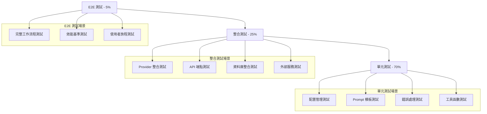

# LeMUR 整合測試策略

## 概述

本文件定義 AssemblyAI LeMUR 整合的全面測試策略，確保雙軌制優化架構的可靠性、效能和品質。

## 測試架構

### 測試金字塔



## 測試分類

### 1. 單元測試 (Unit Tests) - 70%

#### 1.1 配置管理測試
**檔案**: `tests/unit/test_lemur_config.py`

```python
class TestLeMURConfig:
    """測試 LeMUR 配置系統"""
    
    def test_config_loading_with_valid_yaml(self):
        """測試有效 YAML 配置載入"""
        
    def test_config_loading_with_invalid_yaml(self):
        """測試無效 YAML 處理"""
        
    def test_environment_variable_override(self):
        """測試環境變數覆蓋"""
        
    def test_prompt_template_escaping(self):
        """測試 prompt 模板轉義"""
        
    def test_dynamic_config_reload(self):
        """測試動態配置重新載入"""

class TestPromptManagement:
    """測試 Prompt 管理功能"""
    
    def test_get_speaker_prompt_chinese(self):
        """測試中文說話者識別 prompt"""
        
    def test_get_punctuation_prompt_with_context(self):
        """測試帶上下文的標點符號 prompt"""
        
    def test_combined_prompt_formatting(self):
        """測試組合 prompt 格式化"""
        
    def test_prompt_template_variables(self):
        """測試 prompt 模板變數替換"""

    def test_fallback_prompt_mechanism(self):
        """測試 fallback prompt 機制"""
```

#### 1.2 Provider 邏輯測試
**檔案**: `tests/unit/test_assemblyai_provider.py`

```python
class TestAssemblyAIProvider:
    """測試 AssemblyAI Provider 功能"""
    
    def test_should_apply_inline_lemur_chinese(self):
        """測試中文對話是否啟用 inline LeMUR"""
        
    def test_should_apply_inline_lemur_english(self):
        """測試英文對話 LeMUR 判斷"""
        
    def test_coaching_conversation_detection(self):
        """測試教練對話檢測"""
        
    def test_inline_lemur_optimization_success(self):
        """測試 inline LeMUR 優化成功情況"""
        
    def test_inline_lemur_optimization_failure(self):
        """測試 LeMUR 優化失敗降級"""
        
    def test_transcription_result_with_metadata(self):
        """測試包含 metadata 的轉錄結果"""

class TestTranscriptionResult:
    """測試 TranscriptionResult 擴展功能"""
    
    def test_supports_reoptimization(self):
        """測試重新優化支援檢查"""
        
    def test_optimization_summary_generation(self):
        """測試優化摘要生成"""
        
    def test_cost_calculation(self):
        """測試成本計算"""
```

#### 1.3 錯誤處理測試
**檔案**: `tests/unit/test_lemur_error_handling.py`

```python
class TestLeMURErrorHandling:
    """測試 LeMUR 錯誤處理機制"""
    
    def test_lemur_api_error_handling(self):
        """測試 LeMUR API 錯誤處理"""
        
    def test_model_fallback_mechanism(self):
        """測試模型降級機制"""
        
    def test_configuration_error_handling(self):
        """測試配置錯誤處理"""
        
    def test_prompt_formatting_error(self):
        """測試 prompt 格式化錯誤"""
        
    def test_network_timeout_handling(self):
        """測試網路超時處理"""
```

### 2. 整合測試 (Integration Tests) - 25%

#### 2.1 Provider 整合測試
**檔案**: `tests/integration/test_lemur_provider_integration.py`

```python
class TestLeMURProviderIntegration:
    """測試 LeMUR Provider 整合"""
    
    async def test_end_to_end_optimization_flow(self):
        """測試端到端優化流程"""
        # 1. 上傳測試音頻
        # 2. 執行 AssemblyAI 轉錄
        # 3. 驗證 LeMUR 優化結果
        # 4. 檢查資料庫儲存
        
    async def test_dual_track_processing(self):
        """測試雙軌制處理流程"""
        # 測試 inline 和 post 優化的協同工作
        
    async def test_provider_fallback_integration(self):
        """測試 Provider 降級整合"""
        # 測試從 AssemblyAI 降級到 Google STT
        
    async def test_configuration_hot_reload(self):
        """測試配置熱重載整合"""
```

#### 2.2 API 端點整合測試
**檔案**: `tests/integration/test_lemur_api_integration.py`

```python
class TestLeMUAPIIntegration:
    """測試 LeMUR API 整合"""
    
    async def test_reoptimization_endpoint(self):
        """測試重新優化 API 端點"""
        # 1. 創建已轉錄的 session
        # 2. 調用 reoptimization API
        # 3. 驗證結果和成本追蹤
        
    async def test_dialogue_analysis_endpoint(self):
        """測試對話分析 API 端點"""
        
    async def test_optimization_history_endpoint(self):
        """測試優化歷史 API 端點"""
        
    async def test_unauthorized_access_handling(self):
        """測試未授權存取處理"""
```

#### 2.3 資料庫整合測試
**檔案**: `tests/integration/test_lemur_database_integration.py`

```python
class TestLeMURDatabaseIntegration:
    """測試 LeMUR 資料庫整合"""
    
    async def test_session_metadata_persistence(self):
        """測試會話 metadata 持久化"""
        
    async def test_optimization_history_storage(self):
        """測試優化歷史儲存"""
        
    async def test_cost_tracking_accuracy(self):
        """測試成本追蹤準確性"""
        
    async def test_concurrent_optimization_handling(self):
        """測試併發優化處理"""
```

### 3. E2E 測試 (End-to-End Tests) - 5%

#### 3.1 完整工作流程測試
**檔案**: `tests/e2e/test_lemur_complete_workflow.py`

```python
class TestLeMURCompleteWorkflow:
    """測試完整的 LeMUR 工作流程"""
    
    async def test_chinese_coaching_session_complete_flow(self):
        """測試中文教練會話完整流程"""
        # 1. 上傳中文教練對話音頻
        # 2. 驗證自動 inline LeMUR 優化
        # 3. 執行後續對話分析
        # 4. 檢查所有結果和 metadata
        
    async def test_english_coaching_session_complete_flow(self):
        """測試英文教練會話完整流程"""
        
    async def test_mixed_language_handling(self):
        """測試混合語言處理"""
        
    async def test_large_file_processing(self):
        """測試大檔案處理（>10MB）"""

class TestUserJourneyE2E:
    """測試使用者旅程端到端"""
    
    async def test_coach_typical_workflow(self):
        """測試教練典型工作流程"""
        # 模擬教練使用系統的完整流程
        
    async def test_multiple_optimization_rounds(self):
        """測試多輪優化流程"""
        # 測試一個 session 的多次優化
```

#### 3.2 效能基準測試
**檔案**: `tests/e2e/test_lemur_performance_benchmarks.py`

```python
class TestLeMURPerformanceBenchmarks:
    """LeMUR 效能基準測試"""
    
    async def test_inline_optimization_latency(self):
        """測試 inline 優化延遲"""
        # 基準：<30秒 for 10分鐘音頻
        
    async def test_post_optimization_latency(self):
        """測試後續優化延遲"""
        # 基準：<10秒 for 重新優化
        
    async def test_concurrent_processing_throughput(self):
        """測試併發處理吞吐量"""
        # 基準：10個併發請求的處理能力
        
    async def test_memory_usage_under_load(self):
        """測試負載下的記憶體使用"""

class TestScalabilityE2E:
    """可擴展性端到端測試"""
    
    async def test_batch_processing_capability(self):
        """測試批次處理能力"""
        
    async def test_high_volume_optimization(self):
        """測試大量優化處理"""
```

## 測試資料管理

### 測試資料結構

```python
# tests/fixtures/lemur_test_data.py

CHINESE_COACHING_TRANSCRIPT = """
教練: 你好，我是你今天的教練，我們開始吧。你今天想談什麼？
客戶: 我最近工作壓力很大，不知道該怎麼處理。
教練: 能具體說說是什麼樣的壓力嗎？
客戶: 主要是工作量增加了，但時間還是一樣的。
"""

ENGLISH_COACHING_TRANSCRIPT = """
Coach: Hello, I'm your coach today. What would you like to discuss?
Client: I've been feeling overwhelmed at work lately.
Coach: Can you tell me more about what's making you feel overwhelmed?
Client: The workload has increased but I have the same amount of time.
"""

EXPECTED_SPEAKER_MAPPING = {
    "A": "教練",
    "B": "客戶"
}

EXPECTED_OPTIMIZATION_IMPROVEMENTS = [
    "標點符號改善",
    "說話者角色識別",
    "語法結構優化"
]
```

### 測試配置

```yaml
# tests/fixtures/test_lemur_config.yaml
model_settings:
  default_model: "claude3_5_sonnet"  # 測試用較便宜模型
  fallback_model: "claude3_5_sonnet"
  max_output_size: 2000
  enable_combined_mode: true

performance:
  batch_processing:
    max_batch_chars: 1000  # 較小的測試批次
    max_batch_size: 5
    
speaker_identification:
  chinese:
    default: |
      測試用的說話者識別 prompt。
      
      轉錄內容：{transcript_text}
      
      請回覆 JSON 格式：{{"A": "教練", "B": "客戶"}}

punctuation_optimization:
  chinese:
    default: |
      測試用的標點符號優化 prompt。
      
      原始轉錄：{transcript_text}
      
      請直接回覆優化後的文字。
```

## Mock 策略

### AssemblyAI API Mock

```python
# tests/mocks/assemblyai_mock.py

class MockAssemblyAIClient:
    """Mock AssemblyAI 客戶端"""
    
    def __init__(self):
        self.transcripts = {}
        self.lemur_results = {}
    
    def transcribe(self, audio_url: str, config: TranscriptionConfig):
        """Mock 轉錄功能"""
        transcript_id = f"mock_transcript_{uuid.uuid4()}"
        
        mock_transcript = MockTranscript(
            id=transcript_id,
            text=CHINESE_COACHING_TRANSCRIPT,
            status='completed',
            utterances=self._generate_mock_utterances()
        )
        
        self.transcripts[transcript_id] = mock_transcript
        return mock_transcript
    
    def lemur_task(
        self, 
        transcript_ids: List[str], 
        prompt: str, 
        final_model: str
    ):
        """Mock LeMUR 任務"""
        result_id = f"mock_lemur_{uuid.uuid4()}"
        
        mock_result = MockLeMURResult(
            request_id=result_id,
            response=self._generate_mock_lemur_response(prompt),
            usage={"input_tokens": 1000, "output_tokens": 500}
        )
        
        self.lemur_results[result_id] = mock_result
        return mock_result
    
    def _generate_mock_lemur_response(self, prompt: str) -> str:
        """根據 prompt 生成 mock 回應"""
        if "說話者" in prompt or "speaker" in prompt.lower():
            return '{"A": "教練", "B": "客戶"}'
        elif "標點" in prompt or "punctuation" in prompt.lower():
            return "教練：你好，我是你今天的教練，我們開始吧。你今天想談什麼？\n客戶：我最近工作壓力很大，不知道該怎麼處理。"
        elif "combined" in prompt.lower() or "組合" in prompt:
            return """{
                "speaker_mapping": {"A": "教練", "B": "客戶"},
                "optimized_transcript": "教練：你好，我是你今天的教練。\\n客戶：我最近工作壓力很大。"
            }"""
        return "Mock LeMUR response"
```

### 資料庫 Mock

```python
# tests/mocks/database_mock.py

class MockSessionRepository:
    """Mock Session 資料庫操作"""
    
    def __init__(self):
        self.sessions = {}
        self.optimizations = {}
    
    async def get_session_with_transcript_id(
        self, 
        session_id: str, 
        user_id: str
    ) -> Optional[SessionModel]:
        """獲取帶有 transcript_id 的 session"""
        return self.sessions.get(session_id)
    
    async def save_optimization_result(
        self,
        session_id: str,
        optimization_data: Dict
    ):
        """儲存優化結果"""
        self.optimizations.setdefault(session_id, []).append(optimization_data)
    
    async def get_optimization_history(
        self,
        session_id: str,
        user_id: str
    ) -> List[Dict]:
        """獲取優化歷史"""
        return self.optimizations.get(session_id, [])
```

## 測試環境配置

### 本地測試環境

```bash
# 設置測試環境變數
export TESTING=true
export STT_PROVIDER=assemblyai
export LEMUR_MODEL=claude3_5_sonnet
export LEMUR_COMBINED_MODE=true
export DATABASE_URL=sqlite:///:memory:
export REDIS_URL=redis://localhost:6379/1

# 運行測試
pytest tests/unit/ -v
pytest tests/integration/ -v --asyncio-mode=auto
pytest tests/e2e/ -v --asyncio-mode=auto --slow
```

### CI/CD 測試配置

```yaml
# .github/workflows/lemur-tests.yml
name: LeMUR Integration Tests

on:
  push:
    paths:
      - 'src/coaching_assistant/config/lemur_*'
      - 'src/coaching_assistant/services/assemblyai_*'
      - 'src/coaching_assistant/services/lemur_*'
      - 'tests/unit/test_lemur_*'
      - 'tests/integration/test_lemur_*'

jobs:
  lemur-tests:
    runs-on: ubuntu-latest
    
    steps:
    - uses: actions/checkout@v3
    
    - name: Setup Python
      uses: actions/setup-python@v4
      with:
        python-version: '3.11'
        
    - name: Install dependencies
      run: |
        pip install -r requirements-dev.txt
        
    - name: Setup test environment
      run: |
        export TESTING=true
        export LEMUR_MODEL=claude3_5_sonnet
        
    - name: Run unit tests
      run: pytest tests/unit/test_lemur_* -v --cov=src/coaching_assistant/config/lemur_config
      
    - name: Run integration tests  
      run: pytest tests/integration/test_lemur_* -v --asyncio-mode=auto
      
    - name: Run E2E tests (if PR)
      if: github.event_name == 'pull_request'
      run: pytest tests/e2e/test_lemur_* -v --asyncio-mode=auto --slow
```

## 測試資料清理

### 自動清理策略

```python
# tests/conftest.py

@pytest.fixture(autouse=True)
async def cleanup_test_data():
    """自動清理測試資料"""
    yield
    
    # 清理測試產生的檔案
    test_files = Path("tmp/test_*").glob("*")
    for file in test_files:
        file.unlink(missing_ok=True)
    
    # 清理 Redis 測試資料
    if hasattr(pytest, "redis_client"):
        await pytest.redis_client.flushdb()
    
    # 清理資料庫測試資料
    if hasattr(pytest, "test_db"):
        await pytest.test_db.drop_all()

@pytest.fixture
def mock_assemblyai_client():
    """提供 Mock AssemblyAI 客戶端"""
    with patch('assemblyai.Client') as mock_client:
        mock_client.return_value = MockAssemblyAIClient()
        yield mock_client.return_value
```

## 測試報告和監控

### 測試覆蓋率目標

- **單元測試**: >90% 行覆蓋率
- **整合測試**: >80% 功能覆蓋率  
- **E2E 測試**: >95% 關鍵用戶旅程覆蓋

### 測試報告生成

```bash
# 生成詳細測試報告
pytest --cov=src/coaching_assistant --cov-report=html --cov-report=xml tests/

# 生成效能測試報告
pytest tests/e2e/test_lemur_performance_benchmarks.py --benchmark-only --benchmark-json=benchmark.json
```

### 監控和告警

```python
# tests/monitoring/test_health_checks.py

class TestLeMURHealthChecks:
    """LeMUR 系統健康檢查"""
    
    async def test_lemur_api_connectivity(self):
        """測試 LeMUR API 連接性"""
        
    async def test_configuration_validity(self):
        """測試配置有效性"""
        
    async def test_model_availability(self):
        """測試模型可用性"""
        
    async def test_quota_status(self):
        """測試配額狀態"""
```

---

**文件版本**: v1.0  
**最後更新**: 2025-09-08  
**維護者**: QA 團隊