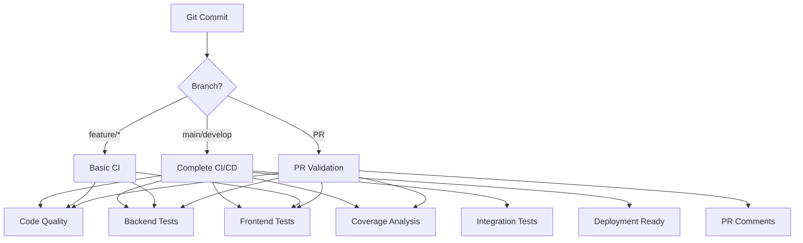

# GitHub Actions CI/CD Pipeline

## 概述

本文檔詳細說明了 Coaching Assistant 專案的完整 CI/CD 管道設計，包含程式碼品質檢查、自動化測試、覆蓋率分析和部署流程。

## 🏗️ 整體架構

### 工作流程圖



## 📋 工作流程詳細說明

### 1. 主要 CI/CD 工作流程 (`.github/workflows/ci-cd.yml`)

#### 觸發條件
- **Push**: `main`, `develop`, `feature/*` 分支
- **Pull Request**: 目標為 `main` 或 `develop` 分支
- **手動觸發**: 通過 GitHub UI 手動執行

#### 工作任務 (Jobs)

##### 🔍 Code Quality Checks
```yaml
runs-on: ubuntu-latest
steps:
  - Python linting (flake8)
  - Architecture compliance checks
  - Upload lint results
```

**執行的檢查項目:**
- **Python Linting**: 使用 `make lint` 執行 flake8 檢查
- **架構合規性**: 使用 `make check-architecture` 檢查 Clean Architecture 規範
- **結果上傳**: 將 lint 結果上傳為 artifacts

##### 🧪 Backend Tests
```yaml
strategy:
  matrix:
    python-version: ['3.11', '3.12']
services:
  - postgres:15
  - redis:7
```

**測試類型:**
- **單元測試**: `make test-unit` - 快速隔離的單元測試
- **資料庫整合測試**: `make test-db` - 使用 PostgreSQL 的整合測試
- **列舉轉換測試**: `make test-enum-conversions` - 測試領域模型與資料庫列舉的轉換
- **Repository 層測試**: `make test-repository-layers` - 測試資料存取層

**環境設定:**
- PostgreSQL 15 測試資料庫
- Redis 7 快取服務
- Python 3.11 和 3.12 矩陣測試

##### 🎨 Frontend Tests
```yaml
runs-on: ubuntu-latest
steps:
  - Next.js linting
  - Jest unit tests
  - Production build
```

**測試內容:**
- **前端 Linting**: `npm run lint` - Next.js ESLint 檢查
- **單元測試**: `npm test` - Jest 單元測試
- **建置驗證**: `npm run build` - 確保生產建置成功

##### 📊 Coverage Analysis
```yaml
if: github.event_name == 'pull_request' || manual trigger
needs: [backend-tests]
```

**覆蓋率分析:**
- **覆蓋率報告**: `make coverage` - 生成詳細的測試覆蓋率報告
- **HTML 報告**: 生成可瀏覽的 HTML 覆蓋率報告
- **PR 評論**: 自動在 PR 中評論覆蓋率結果
- **最低要求**: 核心業務邏輯需達到 85% 覆蓋率

##### 🔗 Integration Tests
```yaml
if: github.ref == 'refs/heads/main'
needs: [backend-tests, frontend-tests]
```

**整合測試:**
- **API 整合測試**: 測試完整的 API 端點
- **E2E 測試**: 端到端功能測試
- **伺服器相依測試**: `make test-server` - 需要執行中的 API 伺服器

##### 🚀 Deployment Readiness
```yaml
if: github.ref == 'refs/heads/main' || github.ref == 'refs/heads/develop'
needs: [code-quality, backend-tests, frontend-tests]
```

**部署準備檢查:**
- 驗證所有品質關卡已通過
- 生成部署摘要報告
- 標記分支為部署就緒狀態

## 🔧 現有工作流程整合

### 保留的工作流程

#### 1. Dependency Injection Tests (`.github/workflows/test-dependency-injection.yml`)
- **用途**: 特定的依賴注入測試
- **觸發**: API 和模型相關檔案變更
- **維持原因**: 針對性的架構驗證

#### 2. Infrastructure CI/CD (`.github/workflows/terraform.yml`)
- **用途**: Terraform 基礎設施管理
- **觸發**: terraform 目錄變更
- **功能**: 基礎設施驗證、規劃和部署

## 📊 測試策略

### 測試層級

```mermaid
pyramid TB
    A[E2E Tests] --> B[Integration Tests]
    B --> C[Unit Tests]

    style A fill:#ff9999
    style B fill:#ffcc99
    style C fill:#99ff99
```

#### 1. 單元測試 (Unit Tests)
- **執行頻率**: 每次提交
- **執行時間**: < 2 分鐘
- **覆蓋範圍**: 業務邏輯、工具函數
- **工具**: pytest

#### 2. 整合測試 (Integration Tests)
- **執行頻率**: 每次提交
- **執行時間**: < 5 分鐘
- **覆蓋範圍**: 資料庫操作、外部服務
- **工具**: pytest + PostgreSQL + Redis

#### 3. E2E 測試 (End-to-End Tests)
- **執行頻率**: main 分支提交
- **執行時間**: < 10 分鐘
- **覆蓋範圍**: 完整使用者流程
- **工具**: pytest + API server

### 品質關卡 (Quality Gates)

#### ✅ 必須通過的檢查
1. **程式碼品質**
   - Python flake8 linting (零錯誤)
   - Next.js ESLint (零錯誤)
   - 架構合規性檢查

2. **測試覆蓋率**
   - 單元測試通過率: 100%
   - 整合測試通過率: 100%
   - 核心邏輯覆蓋率: ≥ 85%

3. **建置驗證**
   - 後端服務啟動成功
   - 前端生產建置成功

## 🚀 部署流程

### 部署環境

#### 1. Staging 環境
- **觸發**: `develop` 分支 push
- **自動化**: CI/CD 通過後自動部署
- **用途**: 功能驗證、測試

#### 2. Production 環境
- **觸發**: `main` 分支 push
- **條件**: 所有 CI/CD 檢查通過
- **審核**: 需要手動審核 (透過 GitHub Environments)

### 部署步驟

1. **預部署檢查**
   - 所有測試通過
   - 程式碼品質檢查通過
   - 覆蓋率達標

2. **基礎設施部署**
   - Terraform 規劃審核
   - 基礎設施更新
   - 健康檢查

3. **應用程式部署**
   - 後端 API 部署 (Render.com)
   - 前端部署 (Cloudflare Workers)
   - 部署後驗證

## 📈 效能優化

### 快取策略

#### 1. 依賴快取
```yaml
- name: Cache uv dependencies
  uses: actions/cache@v3
  with:
    path: ~/.cache/uv
    key: uv-${{ runner.os }}-${{ hashFiles('**/pyproject.toml') }}
```

#### 2. Node.js 快取
```yaml
- name: Set up Node.js
  uses: actions/setup-node@v4
  with:
    cache: 'npm'
    cache-dependency-path: apps/web/package-lock.json
```

### 並行執行

#### 1. 任務並行
- Code Quality + Backend Tests + Frontend Tests 並行執行
- 矩陣測試: Python 3.11 和 3.12 並行測試

#### 2. 條件執行
- Coverage Analysis: 僅在 PR 或手動觸發時執行
- Integration Tests: 僅在 main 分支執行

## 🔍 監控與報告

### Artifacts 保留

#### 1. 測試結果
- **保留期限**: 7 天
- **內容**: 測試日誌、失敗報告

#### 2. 覆蓋率報告
- **保留期限**: 30 天
- **內容**: HTML 報告、詳細分析

#### 3. 部署摘要
- **保留期限**: 30 天
- **內容**: 部署狀態、版本資訊

### 通知機制

#### 1. PR 評論
- 覆蓋率報告自動評論
- 測試失敗詳細資訊

#### 2. GitHub Summary
- 完整的 CI/CD 流程摘要
- 快速命令參考

## 🛠️ 本地開發工具

### 快速命令

#### 後端開發
```bash
# 完整測試流程
make lint && make test-unit

# 覆蓋率分析
make coverage

# 架構檢查
make check-architecture
```

#### 前端開發
```bash
# 進入前端目錄
cd apps/web

# 完整測試流程
npm run lint && npm test

# 建置驗證
npm run build
```

### 建議的開發流程

1. **功能開發**
   ```bash
   git checkout -b feature/new-feature
   # 開發...
   make lint && make test-unit  # 本地驗證
   git push origin feature/new-feature
   ```

2. **Pull Request**
   - CI/CD 自動執行
   - 檢視覆蓋率報告
   - 修正任何失敗的檢查

3. **合併到 develop**
   - 自動部署到 staging 環境
   - 功能驗證

4. **發布到 main**
   - 完整的 CI/CD 流程
   - 自動部署到 production

## 🔧 故障排除

### 常見問題

#### 1. 測試失敗
```bash
# 檢視詳細日誌
cat logs/test-unit.log

# 重新執行特定測試
pytest tests/unit/path/to/test.py -v
```

#### 2. Linting 錯誤
```bash
# 檢視 lint 錯誤
cat logs/lint.log

# 自動修正部分問題
python -m autopep8 --in-place --recursive src/
```

#### 3. 覆蓋率不足
```bash
# 查看覆蓋率報告
open htmlcov/index.html

# 查看未覆蓋的程式碼
make coverage | grep "TOTAL"
```

### 效能問題

#### 1. CI/CD 執行時間過長
- 檢查是否可以增加更多並行任務
- 優化測試執行順序
- 增強快取策略

#### 2. 依賴安裝緩慢
- 確認快取配置正確
- 考慮使用預建的 Docker images

## 📚 相關資源

### 文檔參考
- [GitHub Actions 官方文檔](https://docs.github.com/en/actions)
- [uv 使用指南](https://github.com/astral-sh/uv)
- [Makefile 命令參考](../../Makefile)

### 內部文檔
- [架構文檔](../claude/architecture.md)
- [開發標準](../claude/development-standards.md)
- [API 測試標準](../claude/api-standards.md)

## 🔄 持續改進

### 計劃中的增強功能

#### 1. 自動化發布
- 基於語義版本控制的自動標籤
- 自動生成 CHANGELOG
- 自動建立 GitHub Releases

#### 2. 效能監控
- 測試執行時間趨勢
- 建置大小監控
- 依賴安全性掃描

#### 3. 高級測試
- 視覺回歸測試
- 效能基準測試
- 負載測試整合

---

**最後更新**: $(date)
**維護者**: Development Team
**版本**: v1.0