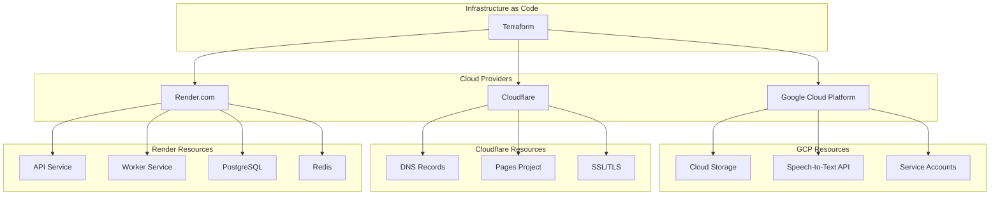

# Infrastructure as Code (IaC) Deployment Strategy

## 概述

本文件規劃使用 Terraform 統一管理 Coaching Assistant Platform 的完整基礎設施，包括 Google Cloud Platform (GCP)、Cloudflare 和 Render.com 的資源。

## 目標

- 🎯 **統一管理**: 透過 Terraform 管理所有雲端資源
- 🔄 **可重現性**: 確保環境一致性和部署可重現
- 🚀 **自動化部署**: 整合 CI/CD 流程
- 📋 **版本控制**: 基礎設施變更追蹤和回滾
- 🛡️ **安全管理**: 統一的環境變數和憑證管理

## 當前架構

### 現有基礎設施
- ✅ **GCP**: Cloud Storage, Speech-to-Text API, IAM (已有 Terraform)
- ❌ **Cloudflare**: Pages (手動管理)
- ❌ **Render.com**: API + Worker 服務 (手動管理)

### 目標架構

## 實作計劃

### Phase 1: Terraform 結構設計
- [ ] 創建 Terraform 模組結構
- [ ] 設置 Provider 配置
- [ ] 建立狀態管理策略

### Phase 2: Cloudflare 自動化
- [ ] DNS 記錄管理
- [ ] Pages 專案配置
- [ ] SSL/TLS 自動化

### Phase 3: Render.com 自動化
- [ ] API 服務部署
- [ ] Worker 服務配置
- [ ] 資料庫管理

### Phase 4: 整合與優化
- [ ] CI/CD 整合
- [ ] 環境變數管理
- [ ] 監控和日誌

## 詳細規劃

### [1. Terraform 架構設計](./TERRAFORM_ARCHITECTURE.md)
- 模組化設計
- 狀態管理
- 環境分離

### [2. Cloudflare 配置](./CLOUDFLARE_CONFIG.md)
- DNS 管理
- Pages 自動化
- 安全設定

### [3. Render.com 配置](./RENDER_CONFIG.md)
- 服務部署
- 環境變數
- 資料庫管理

### [4. CI/CD 整合](./CICD_INTEGRATION.md)
- GitHub Actions
- 自動化部署
- 環境保護

### [5. 安全管理](./SECURITY_MANAGEMENT.md)
- 憑證管理
- 環境變數
- 存取控制

## 實作時程

| 階段 | 預估時間 | 負責人 | 狀態 |
|------|----------|--------|------|
| Phase 1 | 2-3 天 | DevOps | 規劃中 |
| Phase 2 | 3-4 天 | DevOps | 規劃中 |
| Phase 3 | 4-5 天 | DevOps | 規劃中 |
| Phase 4 | 2-3 天 | DevOps | 規劃中 |

## 風險評估

### 高風險
- 🔴 **服務中斷**: 遷移過程可能導致短時間服務不可用
- 🔴 **資料遺失**: 不當操作可能影響現有資源

### 中風險  
- 🟡 **配置錯誤**: Terraform 配置錯誤可能需要手動修復
- 🟡 **權限問題**: API Token 或權限配置不當

### 緩解措施
- ✅ **備份策略**: 實施前完整備份所有配置
- ✅ **段階部署**: 分階段進行，降低影響範圍
- ✅ **回滾計劃**: 準備快速回滾機制

## 成功指標

- ✅ 所有環境可透過 Terraform 完整重建
- ✅ 部署時間減少 50% 以上
- ✅ 環境配置錯誤減少 80%
- ✅ 支援多環境 (dev/staging/prod) 管理

## 參考資源

- [Terraform Best Practices](https://www.terraform-best-practices.com/)
- [Cloudflare Terraform Provider](https://registry.terraform.io/providers/cloudflare/cloudflare/latest/docs)
- [Render Terraform Provider](https://registry.terraform.io/providers/render-oss/render/latest/docs)
- [GCP Terraform Provider](https://registry.terraform.io/providers/hashicorp/google/latest/docs)

---

**最後更新**: 2025-08-17  
**版本**: v1.0  
**狀態**: 規劃中