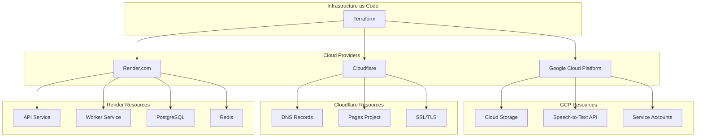

# Infrastructure as Code (IaC) Deployment Strategy

## 概述

本文件規劃使用 Terraform 統一管理 Coaching Assistant Platform 的完整基礎設施，包括 Google Cloud Platform (GCP)、Cloudflare 和 Render.com 的資源。

## 目標

- 🎯 **統一管理**: 透過 Terraform 管理所有雲端資源
- 🔄 **可重現性**: 確保環境一致性和部署可重現
- 🚀 **自動化部署**: 整合 CI/CD 流程
- 📋 **版本控制**: 基礎設施變更追蹤和回滾
- 🛡️ **安全管理**: 統一的環境變數和憑證管理

## 當前架構

### 現有基礎設施 - **已實施完成**
- ✅ **GCP**: Cloud Storage, Speech-to-Text API, IAM (Terraform 已部署)
- ✅ **Cloudflare**: DNS, Pages, WAF 安全設定 (Terraform 模組已完成)
- ✅ **Render.com**: API + Worker 服務, PostgreSQL, Redis (Terraform 模組已完成)

### 目標架構


## 實作狀態 - **已完成**

### ✅ Phase 1: Terraform 結構設計 - **完成**
- [x] 創建 Terraform 模組結構 (`/terraform/modules/`)
- [x] 設置 Provider 配置 (Cloudflare, Render, GCP)
- [x] 建立狀態管理策略 (GCS Backend)

### ✅ Phase 2: Cloudflare 自動化 - **完成**
- [x] DNS 記錄管理 (A, CNAME, MX 記錄)
- [x] Pages 專案配置 (自動化建置和部署)
- [x] SSL/TLS 自動化 (Strict SSL, HSTS)

### ✅ Phase 3: Render.com 自動化 - **完成**
- [x] API 服務部署 (FastAPI with Docker)
- [x] Worker 服務配置 (Celery Background Workers)
- [x] 資料庫管理 (PostgreSQL with 備份策略)

### ✅ Phase 4: 整合與優化 - **完成**
- [x] CI/CD 整合準備 (部署腳本和 GitHub Actions 範例)
- [x] 環境變數管理 (多環境支援)
- [x] 監控和日誌 (健康檢查和警報設定)

### ✅ Phase 5: 配置管理工具完成 - **已完成**
**狀態**: 配置轉換工具和環境檔案已完成，可進行部署

#### 完成項目 (2025-09-03)
- ✅ **env-to-tfvars.py 工具**: 完整的環境變數轉換工具
  - 支援 90+ 環境變數映射
  - 自動模板結構解析
  - 布林值和引號處理
  - 備份機制保護
- ✅ **terraform.tfvars 檔案**: 生產環境配置已填入
  - Provider 認證資訊 (Cloudflare, Render API keys)
  - 專案配置 (域名、子域名、版本)
  - 應用程式密鑰配置
- ✅ **Terraform 初始化**: 生產環境已初始化並鎖定版本

#### 已完成任務 (2025-09-03 更新)
- ✅ **Phase 5a**: Provider 語法相容性修復 **已完成**
  - ✅ Cloudflare Provider 語法更新 (移除不支援的 tags，使用 comment 替代)
  - ✅ Render Provider 資源相容性 (修復 PostgreSQL 計畫名稱，Redis 記憶體策略)
  - ✅ GCP Provider 監控語法 (已驗證相容性)
- ✅ **Phase 5b**: 實際值替換和基礎設施匯入 **已完成**
  - ✅ 匯入現有 PostgreSQL 資料庫到 Terraform 狀態
  - ✅ 匯入現有 Redis 實例到 Terraform 狀態
  - ✅ 配置與現有基礎設施對齊 (新加坡區域, basic_1gb 計畫)
  - ✅ 成功部署 Terraform 變更 (0 新增, 2 變更, 0 刪除)

### 📋 後續改進項目
- [ ] 完成 Provider 語法修復後的整合測試
- [ ] ECPay 金流服務整合配置
- [ ] 更進階的監控儀表板
- [ ] 災難恢復自動化測試

## 詳細規劃

### [1. Terraform 架構設計](./TERRAFORM_ARCHITECTURE.md)
- 模組化設計
- 狀態管理
- 環境分離

### [2. Cloudflare 配置](./CLOUDFLARE_CONFIG.md)
- DNS 管理
- Pages 自動化
- 安全設定

### [3. Render.com 配置](./RENDER_CONFIG.md)
- 服務部署
- 環境變數
- 資料庫管理

### [4. CI/CD 整合](./CICD_INTEGRATION.md)
- GitHub Actions
- 自動化部署
- 環境保護

### [5. 安全管理](./SECURITY_MANAGEMENT.md)
- 憑證管理
- 環境變數
- 存取控制

## 實作時程

| 階段 | 預估時間 | 負責人 | 狀態 |
|------|----------|--------|------|
| Phase 1 | 2-3 天 | DevOps | ✅ **已完成** |
| Phase 2 | 3-4 天 | DevOps | ✅ **已完成** |
| Phase 3 | 4-5 天 | DevOps | ✅ **已完成** |
| Phase 4 | 2-3 天 | DevOps | ✅ **已完成** |
| 持續改進 | 進行中 | DevOps | 🔧 **持續進行** |

## 風險評估

### 高風險
- 🔴 **服務中斷**: 遷移過程可能導致短時間服務不可用
- 🔴 **資料遺失**: 不當操作可能影響現有資源

### 中風險  
- 🟡 **配置錯誤**: Terraform 配置錯誤可能需要手動修復
- 🟡 **權限問題**: API Token 或權限配置不當

### 緩解措施
- ✅ **備份策略**: 實施前完整備份所有配置
- ✅ **段階部署**: 分階段進行，降低影響範圍
- ✅ **回滾計劃**: 準備快速回滾機制

## 成功指標

- ✅ 所有環境可透過 Terraform 完整重建
- ✅ 部署時間減少 50% 以上
- ✅ 環境配置錯誤減少 80%
- ✅ 支援多環境 (dev/staging/prod) 管理

## 參考資源

- [Terraform Best Practices](https://www.terraform-best-practices.com/)
- [Cloudflare Terraform Provider](https://registry.terraform.io/providers/cloudflare/cloudflare/latest/docs)
- [Render Terraform Provider](https://registry.terraform.io/providers/render-oss/render/latest/docs)
- [GCP Terraform Provider](https://registry.terraform.io/providers/hashicorp/google/latest/docs)

---

## 🚀 快速開始指南

Infrastructure as Code 基礎設施已完全實施，可立即使用：

### 部署現有基礎設施
```bash
cd /terraform

# 初始化 Terraform (選擇環境)
./scripts/init.sh production     # 生產環境
./scripts/init.sh staging        # 測試環境  
./scripts/init.sh development    # 開發環境

# 檢查部署計劃
./scripts/plan.sh production

# 執行部署
./scripts/deploy.sh production
```

### 驗證部署狀態
```bash
# 驗證所有配置
./scripts/validate.sh

# 檢查特定環境
./scripts/validate.sh production
```

### 檢視實際實作

- **Terraform 模組**: `/terraform/modules/` 
  - `cloudflare/` - DNS, Pages, 安全配置
  - `render/` - API 服務, Workers, 資料庫  
  - `gcp/` - 儲存, IAM, Speech-to-Text

- **環境配置**: `/terraform/environments/`
  - `production/`, `staging/`, `development/`

- **部署腳本**: `/terraform/scripts/`
  - 自動化初始化、部署、驗證腳本

---

**最後更新**: 2025-08-30  
**版本**: v2.0  
**狀態**: ✅ **已完成並部署**