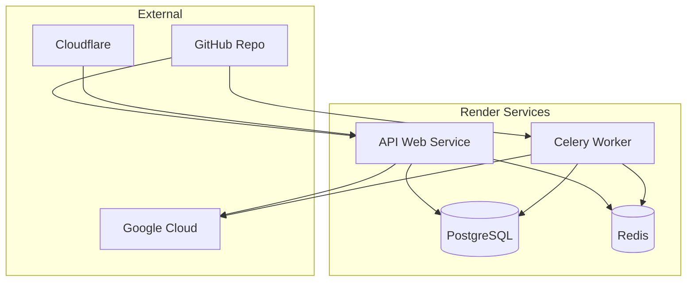

# Render.com 配置管理

## 概述

使用 Terraform 自動化管理 Render.com 的 Web Services、Background Workers、資料庫和相關基礎設施配置。

## 當前配置問題

### 手動管理的挑戰
- ❌ 服務配置手動維護
- ❌ 環境變數分散設定
- ❌ 資料庫備份策略不統一
- ❌ 擴展配置不一致

### 目標狀態
- ✅ 所有服務透過 Terraform 管理
- ✅ 統一的環境變數管理
- ✅ 自動化備份和監控
- ✅ 一致的擴展策略

## 服務架構



## Web Service 配置

### 1. API 服務

```hcl
resource "render_web_service" "api" {
  name               = "${var.project_name}-api-${var.environment}"
  runtime           = "docker"
  repo              = var.github_repo_url
  branch            = var.branch
  root_directory    = "apps/api-server"
  dockerfile_path   = "Dockerfile.api"
  
  service_details {
    env              = var.environment
    plan             = var.api_plan
    region           = var.region
    num_instances    = var.api_instances
    
    auto_deploy      = var.auto_deploy
    
    # Build configuration
    build_command    = ""  # Docker build
    start_command    = ""  # Use Dockerfile CMD
    
    # Health check
    health_check_path = "/api/health"
    
    # Environment variables
    environment_variables = merge(
      local.common_env_vars,
      {
        # Container specific
        IS_CONTAINER = "true"
        PORT         = "10000"
        
        # Database connections
        DATABASE_URL = render_postgres.main.connection_string
        REDIS_URL    = render_redis.main.connection_string
        
        # Application config
        ENVIRONMENT     = var.environment
        SECRET_KEY      = var.api_secret_key
        DEBUG           = var.environment == "development" ? "true" : "false"
        
        # CORS configuration
        ALLOWED_ORIGINS = join(",", var.allowed_origins)
        
        # GCP configuration
        GCP_PROJECT_ID                     = var.gcp_project_id
        GOOGLE_APPLICATION_CREDENTIALS_JSON = var.gcp_service_account_json
        AUDIO_STORAGE_BUCKET              = var.audio_storage_bucket
        TRANSCRIPT_STORAGE_BUCKET         = var.transcript_storage_bucket
        
        # STT configuration
        STT_PROVIDER                = var.stt_provider
        GOOGLE_STT_MODEL           = var.google_stt_model
        GOOGLE_STT_LOCATION        = var.google_stt_location
        ASSEMBLYAI_API_KEY         = var.assemblyai_api_key
        
        # Security
        JWT_ALGORITHM                    = "HS256"
        ACCESS_TOKEN_EXPIRE_MINUTES      = "30"
        REFRESH_TOKEN_EXPIRE_DAYS        = "7"
        
        # Google OAuth
        GOOGLE_CLIENT_ID     = var.google_client_id
        GOOGLE_CLIENT_SECRET = var.google_client_secret
        
        # reCAPTCHA
        RECAPTCHA_ENABLED    = var.recaptcha_enabled
        RECAPTCHA_SECRET     = var.recaptcha_secret
        RECAPTCHA_MIN_SCORE  = var.recaptcha_min_score
        
        # File upload limits
        MAX_FILE_SIZE       = var.max_file_size
        MAX_AUDIO_DURATION  = var.max_audio_duration
        
        # Logging
        LOG_LEVEL  = var.log_level
        LOG_FORMAT = "json"
      }
    )
    
    # Secret files (if needed)
    secret_files = var.secret_files
  }
  
  # Custom domains
  custom_domains = var.api_custom_domains
  
  # Auto-scaling
  auto_scaling {
    enabled = var.enable_auto_scaling
    min_instances = var.min_instances
    max_instances = var.max_instances
    target_cpu_percent = var.target_cpu_percent
    target_memory_percent = var.target_memory_percent
  }
  
  tags = [
    "terraform",
    "coaching-assistant",
    "api",
    var.environment
  ]
}
```

### 2. Health Check 配置

```hcl
# Custom health check endpoint configuration
resource "render_web_service_header" "api_health" {
  service_id = render_web_service.api.id
  
  headers = {
    "X-Health-Check" = "enabled"
    "X-Environment"  = var.environment
  }
}
```

## Background Worker 配置

### 1. Celery Worker

```hcl
resource "render_background_worker" "celery" {
  name               = "${var.project_name}-worker-${var.environment}"
  runtime           = "docker"
  repo              = var.github_repo_url
  branch            = var.branch
  root_directory    = "apps/worker"
  dockerfile_path   = "Dockerfile"
  
  service_details {
    env              = var.environment
    plan             = var.worker_plan
    region           = var.region
    
    auto_deploy      = var.auto_deploy
    
    # Worker specific configuration
    start_command    = "celery -A coaching_assistant.core.celery_app worker --loglevel=info --concurrency=4"
    
    # Environment variables (shared with API)
    environment_variables = merge(
      local.common_env_vars,
      {
        # Container specific
        IS_CONTAINER = "true"
        
        # Database connections
        DATABASE_URL = render_postgres.main.connection_string
        REDIS_URL    = render_redis.main.connection_string
        
        # Worker configuration
        WORKER_CONCURRENCY = var.worker_concurrency
        TASK_TIME_LIMIT    = var.task_time_limit
        
        # Same config as API for consistency
        ENVIRONMENT                        = var.environment
        GCP_PROJECT_ID                     = var.gcp_project_id
        GOOGLE_APPLICATION_CREDENTIALS_JSON = var.gcp_service_account_json
        AUDIO_STORAGE_BUCKET              = var.audio_storage_bucket
        TRANSCRIPT_STORAGE_BUCKET         = var.transcript_storage_bucket
        
        # STT configuration
        STT_PROVIDER        = var.stt_provider
        GOOGLE_STT_MODEL    = var.google_stt_model
        GOOGLE_STT_LOCATION = var.google_stt_location
        ASSEMBLYAI_API_KEY  = var.assemblyai_api_key
        
        # Logging
        LOG_LEVEL  = var.log_level
        LOG_FORMAT = "json"
      }
    )
    
    secret_files = var.secret_files
  }
  
  # Auto-scaling for workers
  auto_scaling {
    enabled = var.enable_worker_auto_scaling
    min_instances = var.worker_min_instances
    max_instances = var.worker_max_instances
    target_cpu_percent = var.worker_target_cpu_percent
    target_memory_percent = var.worker_target_memory_percent
  }
  
  tags = [
    "terraform",
    "coaching-assistant", 
    "worker",
    var.environment
  ]
}
```

### 2. Monitoring Worker (Optional)

```hcl
resource "render_background_worker" "flower" {
  count = var.enable_flower_monitoring ? 1 : 0
  
  name               = "${var.project_name}-flower-${var.environment}"
  runtime           = "docker"
  repo              = var.github_repo_url
  branch            = var.branch
  root_directory    = "apps/worker"
  dockerfile_path   = "Dockerfile.flower"
  
  service_details {
    env              = var.environment
    plan             = "starter"  # Smaller plan for monitoring
    region           = var.region
    
    start_command    = "celery -A coaching_assistant.core.celery_app flower --port=5555"
    
    environment_variables = {
      REDIS_URL           = render_redis.main.connection_string
      FLOWER_BASIC_AUTH   = var.flower_auth
      FLOWER_PORT         = "5555"
    }
  }
  
  tags = ["terraform", "monitoring", var.environment]
}
```

## 資料庫配置

### 1. PostgreSQL 主資料庫

```hcl
resource "render_postgres" "main" {
  name                = "${var.project_name}-db-${var.environment}"
  plan               = var.database_plan
  region             = var.region
  version            = var.postgres_version
  
  # High availability (for production)
  high_availability  = var.environment == "production" ? true : false
  
  # Database configuration
  database_name = var.database_name
  database_user = var.database_user
  
  # Backup configuration
  backup_enabled = true
  backup_retention_days = var.backup_retention_days
  
  # Maintenance window
  maintenance_window {
    day_of_week = var.maintenance_day      # "sunday"
    start_time  = var.maintenance_time     # "02:00"
    duration    = var.maintenance_duration # "1h"
  }
  
  # Performance settings
  shared_preload_libraries = ["pg_stat_statements"]
  
  tags = [
    "terraform",
    "coaching-assistant",
    "database",
    var.environment
  ]
}
```

### 2. 讀取副本 (Production only)

```hcl
resource "render_postgres_read_replica" "main_replica" {
  count = var.environment == "production" && var.enable_read_replica ? 1 : 0
  
  name               = "${var.project_name}-db-replica-${var.environment}"
  primary_postgres_id = render_postgres.main.id
  region             = var.replica_region  # Different region for disaster recovery
  
  tags = [
    "terraform",
    "coaching-assistant",
    "database-replica",
    var.environment
  ]
}
```

### 3. 備份策略

```hcl
resource "render_postgres_backup_policy" "main" {
  postgres_id = render_postgres.main.id
  
  # Daily backups
  retention_days = var.backup_retention_days
  
  schedule {
    hour   = var.backup_hour    # 2 (2 AM)
    minute = var.backup_minute  # 0
  }
  
  # Point-in-time recovery (Enterprise only)
  point_in_time_recovery_enabled = var.environment == "production" ? true : false
}
```

## Redis 配置

### 1. Redis 主實例

```hcl
resource "render_redis" "main" {
  name   = "${var.project_name}-redis-${var.environment}"
  plan   = var.redis_plan
  region = var.region
  
  # Redis configuration
  max_memory_policy = "allkeys-lru"
  
  # High availability (for production)
  high_availability = var.environment == "production" ? true : false
  
  # Backup configuration
  backup_enabled = true
  backup_retention_days = var.redis_backup_retention_days
  
  tags = [
    "terraform",
    "coaching-assistant",
    "redis",
    var.environment
  ]
}
```

### 2. Redis 監控

```hcl
resource "render_redis_monitoring" "main" {
  redis_id = render_redis.main.id
  
  # Alert thresholds
  memory_usage_threshold = 80  # Alert at 80% memory usage
  cpu_usage_threshold    = 70  # Alert at 70% CPU usage
  
  notification_email = var.monitoring_email
}
```

## 環境變數管理

### 1. 共用環境變數

```hcl
locals {
  common_env_vars = {
    # Version info
    APP_VERSION     = var.app_version
    BUILD_ID        = var.build_id
    COMMIT_SHA      = var.commit_sha
    
    # Monitoring
    SENTRY_DSN      = var.sentry_dsn
    
    # Feature flags
    ENABLE_SPEAKER_DIARIZATION = var.enable_speaker_diarization
    ENABLE_PUNCTUATION        = var.enable_punctuation
    
    # Storage configuration
    STORAGE_BUCKET      = var.storage_bucket_pattern
    RETENTION_DAYS      = var.retention_days
    SIGNED_URL_EXPIRY_MINUTES = var.signed_url_expiry
  }
}
```

### 2. 環境特定配置

```hcl
# Development environment
resource "render_env_var_group" "development" {
  count = var.environment == "development" ? 1 : 0
  
  name = "coaching-assistant-dev"
  
  environment_variables = {
    DEBUG           = "true"
    LOG_LEVEL      = "DEBUG"
    RECAPTCHA_ENABLED = "false"
    MAX_FILE_SIZE   = "50"  # Smaller limits for dev
  }
}

# Production environment
resource "render_env_var_group" "production" {
  count = var.environment == "production" ? 1 : 0
  
  name = "coaching-assistant-prod"
  
  environment_variables = {
    DEBUG           = "false"
    LOG_LEVEL      = "INFO"
    RECAPTCHA_ENABLED = "true"
    MAX_FILE_SIZE   = "500"  # Full limits for prod
  }
}
```

## 監控和警報

### 1. 服務監控

```hcl
resource "render_service_monitoring" "api" {
  service_id = render_web_service.api.id
  
  # Health check configuration
  health_check_enabled = true
  health_check_path    = "/api/health"
  health_check_interval = 30  # seconds
  
  # Alert configuration
  alerts = [
    {
      type = "response_time"
      threshold = 5000  # 5 seconds
      notification_email = var.monitoring_email
    },
    {
      type = "error_rate"
      threshold = 5  # 5%
      notification_email = var.monitoring_email
    },
    {
      type = "cpu_usage"
      threshold = 80  # 80%
      notification_email = var.monitoring_email
    },
    {
      type = "memory_usage"
      threshold = 85  # 85%
      notification_email = var.monitoring_email
    }
  ]
}

resource "render_service_monitoring" "worker" {
  service_id = render_background_worker.celery.id
  
  alerts = [
    {
      type = "cpu_usage"
      threshold = 80
      notification_email = var.monitoring_email
    },
    {
      type = "memory_usage" 
      threshold = 85
      notification_email = var.monitoring_email
    }
  ]
}
```

### 2. 資料庫監控

```hcl
resource "render_postgres_monitoring" "main" {
  postgres_id = render_postgres.main.id
  
  alerts = [
    {
      type = "connection_count"
      threshold = 80  # 80% of max connections
      notification_email = var.monitoring_email
    },
    {
      type = "storage_usage"
      threshold = 85  # 85% of disk space
      notification_email = var.monitoring_email
    },
    {
      type = "query_duration"
      threshold = 10000  # 10 seconds
      notification_email = var.monitoring_email
    }
  ]
}
```

## 變數定義

### 1. 服務配置

```hcl
# Service configuration
variable "project_name" {
  description = "Project name prefix"
  type        = string
  default     = "coaching-assistant"
}

variable "environment" {
  description = "Environment (development, staging, production)"
  type        = string
}

variable "region" {
  description = "Render region"
  type        = string
  default     = "oregon"
}

variable "github_repo_url" {
  description = "GitHub repository URL"
  type        = string
}

variable "branch" {
  description = "Git branch to deploy"
  type        = string
  default     = "main"
}

# Plans and scaling
variable "api_plan" {
  description = "API service plan"
  type        = string
  default     = "standard"
}

variable "worker_plan" {
  description = "Worker service plan"
  type        = string
  default     = "standard"
}

variable "database_plan" {
  description = "Database plan"
  type        = string
  default     = "standard"
}

variable "redis_plan" {
  description = "Redis plan"
  type        = string
  default     = "standard"
}

# Auto-scaling
variable "enable_auto_scaling" {
  description = "Enable auto-scaling for API service"
  type        = bool
  default     = true
}

variable "min_instances" {
  description = "Minimum number of API instances"
  type        = number
  default     = 1
}

variable "max_instances" {
  description = "Maximum number of API instances"
  type        = number
  default     = 5
}

variable "target_cpu_percent" {
  description = "Target CPU percentage for auto-scaling"
  type        = number
  default     = 70
}
```

### 2. 應用程式配置

```hcl
# Application configuration
variable "api_secret_key" {
  description = "API secret key"
  type        = string
  sensitive   = true
}

variable "allowed_origins" {
  description = "CORS allowed origins"
  type        = list(string)
  default     = [
    "https://coachly.doxa.com.tw",
    "http://localhost:3000"
  ]
}

variable "gcp_project_id" {
  description = "GCP project ID"
  type        = string
}

variable "gcp_service_account_json" {
  description = "GCP service account JSON"
  type        = string
  sensitive   = true
}

# STT configuration
variable "stt_provider" {
  description = "Speech-to-Text provider"
  type        = string
  default     = "google"
}

variable "google_stt_model" {
  description = "Google STT model"
  type        = string
  default     = "chirp_2"
}

variable "assemblyai_api_key" {
  description = "AssemblyAI API key"
  type        = string
  sensitive   = true
}
```

## 輸出值

```hcl
# outputs.tf
output "api_service_id" {
  description = "API service ID"
  value       = render_web_service.api.id
}

output "api_service_url" {
  description = "API service URL"
  value       = render_web_service.api.service_url
}

output "worker_service_id" {
  description = "Worker service ID"
  value       = render_background_worker.celery.id
}

output "database_connection_string" {
  description = "Database connection string"
  value       = render_postgres.main.connection_string
  sensitive   = true
}

output "redis_connection_string" {
  description = "Redis connection string" 
  value       = render_redis.main.connection_string
  sensitive   = true
}

output "database_host" {
  description = "Database host"
  value       = render_postgres.main.host
}

output "database_port" {
  description = "Database port"
  value       = render_postgres.main.port
}

output "api_custom_domains" {
  description = "API custom domains"
  value       = render_web_service.api.custom_domains
}
```

## 部署腳本

### 1. 部署驗證

```bash
#!/bin/bash
# scripts/verify-render-deployment.sh

set -e

ENVIRONMENT=${1:-production}
API_URL=${2:-https://api.doxa.com.tw}

echo "🔍 Verifying Render deployment for environment: $ENVIRONMENT"

# Check API health
echo "Checking API health..."
API_HEALTH=$(curl -s -o /dev/null -w "%{http_code}" $API_URL/api/health)
if [ $API_HEALTH -eq 200 ]; then
    echo "✅ API health check passed"
else
    echo "❌ API health check failed (HTTP $API_HEALTH)"
    exit 1
fi

# Check API version
echo "Checking API version..."
API_VERSION=$(curl -s $API_URL/api/health | jq -r '.version // "unknown"')
echo "📦 API Version: $API_VERSION"

# Check database connection
echo "Checking database connectivity..."
DB_STATUS=$(curl -s $API_URL/api/health | jq -r '.database.status // "unknown"')
if [ "$DB_STATUS" = "healthy" ]; then
    echo "✅ Database connection healthy"
else
    echo "❌ Database connection issues: $DB_STATUS"
fi

# Check Redis connection
echo "Checking Redis connectivity..."
REDIS_STATUS=$(curl -s $API_URL/api/health | jq -r '.redis.status // "unknown"')
if [ "$REDIS_STATUS" = "healthy" ]; then
    echo "✅ Redis connection healthy"
else
    echo "❌ Redis connection issues: $REDIS_STATUS"
fi

echo "🏁 Render deployment verification completed"
```

### 2. 資料庫遷移

```bash
#!/bin/bash
# scripts/migrate-database.sh

set -e

ENVIRONMENT=${1:-production}
API_URL=${2:-https://api.doxa.com.tw}

echo "🗄️ Running database migrations for environment: $ENVIRONMENT"

# Trigger migration endpoint
MIGRATION_RESULT=$(curl -s -X POST \
  -H "Authorization: Bearer $ADMIN_TOKEN" \
  -H "Content-Type: application/json" \
  "$API_URL/api/admin/migrate")

MIGRATION_STATUS=$(echo $MIGRATION_RESULT | jq -r '.status // "failed"')

if [ "$MIGRATION_STATUS" = "success" ]; then
    echo "✅ Database migrations completed successfully"
    echo "📊 Migration details:"
    echo $MIGRATION_RESULT | jq '.migrations // []'
else
    echo "❌ Database migrations failed"
    echo "Error: $(echo $MIGRATION_RESULT | jq -r '.error // "Unknown error"')"
    exit 1
fi
```

---

**最後更新**: 2025-08-17  
**版本**: v1.0