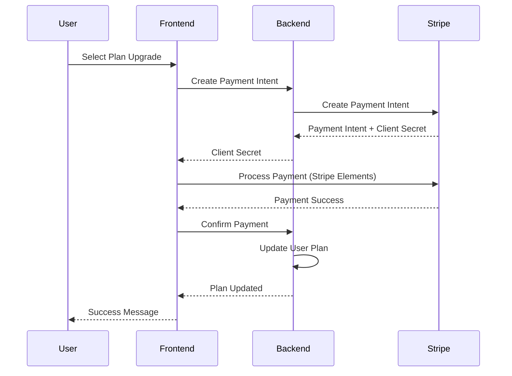

# Payment Integration System

## 📋 Overview
This feature implements a comprehensive payment processing system to enable plan upgrades, billing, and subscription management for the Coaching Assistant Platform.

## 🎯 Business Context
- **Problem**: No payment processing capability for plan upgrades
- **Impact**: Cannot monetize platform, users stuck on free tier
- **Solution**: Multi-provider payment integration supporting both international and Taiwan markets

## 🌏 Payment Provider Strategy

### Primary Providers
1. **Stripe** - International markets (Global)
   - Best for international customers
   - Comprehensive subscription management
   - Strong developer ecosystem

2. **台灣綠界 (ECPay)** - Taiwan market (Local)
   - Optimized for Taiwan users
   - Local payment methods (ATM, convenience stores)
   - Better conversion rates for Taiwan customers
   - Support for TWD currency

### Provider Selection Logic
- **Geographic detection**: Auto-select based on user location/preference
- **Currency preference**: TWD → ECPay, USD/Other → Stripe  
- **User choice**: Allow manual provider selection in settings
- **Fallback strategy**: Primary provider failure → secondary provider

## 💼 Business Value

### ✅ For Users
- **Seamless Upgrades**: One-click plan upgrades with secure payment
- **Local Payment Options**: Taiwan users get native payment methods (ATM, convenience stores)
- **Flexible Billing**: Monthly/annual billing options in preferred currency
- **Payment Security**: PCI-compliant payment processing
- **Billing Transparency**: Clear invoices and payment history

### ✅ For Business
- **Revenue Generation**: Enable actual payment collection with regional optimization
- **Market Penetration**: Better Taiwan market conversion with local payment methods
- **Subscription Management**: Automated recurring billing across providers
- **Payment Analytics**: Revenue tracking and forecasting across regions
- **Compliance**: PCI DSS compliant payment processing for both providers

## 🗺️ Story Map

### 🏗️ Foundation Features (Phase 1)
Core payment infrastructure

| Story | Title | Priority | Backend | Frontend | Status |
|-------|-------|----------|---------|----------|--------|
| US007 | Multi-Provider Payment Setup | P0 | ❌ TODO | ❌ TODO | 📝 Ready |
| US007a | - Stripe Integration | P0 | ❌ TODO | ❌ TODO | 📝 Ready |
| US007b | - ECPay (綠界) Integration | P0 | ❌ TODO | ❌ TODO | 📝 Ready |
| US008 | Payment Method Management | P0 | ❌ TODO | ❌ TODO | 📝 Ready |
| US009 | Plan Upgrade Flow | P0 | ❌ TODO | ❌ TODO | 📝 Ready |
| US010 | Subscription Management | P0 | ❌ TODO | ❌ TODO | 📝 Ready |

### 💰 Billing & User Experience (Phase 2)  
Enhanced payment features

| Story | Title | Priority | Backend | Frontend | Status |
|-------|-------|----------|---------|----------|--------|
| US011 | Multi-Provider Invoice Generation | P1 | ❌ TODO | ❌ TODO | 📝 Ready |
| US012 | Payment History Dashboard | P1 | ❌ TODO | ❌ TODO | 📝 Ready |
| US013 | Failed Payment Handling | P1 | ❌ TODO | ❌ TODO | 📝 Ready |
| US014 | Billing Notifications (Multi-language) | P1 | ❌ TODO | ❌ TODO | 📝 Ready |
| US015 | Provider Selection & Management | P1 | ❌ TODO | ❌ TODO | 📝 Ready |

## 🏗️ Technical Architecture

### Payment Flow


### Database Schema
```sql
-- Payment providers configuration
CREATE TABLE payment_providers (
  id UUID PRIMARY KEY,
  name VARCHAR(50) NOT NULL, -- 'stripe', 'ecpay'
  display_name VARCHAR(100), -- 'Stripe', '綠界科技'
  is_active BOOLEAN DEFAULT true,
  supported_currencies JSONB, -- ['USD', 'EUR'] or ['TWD']
  supported_regions JSONB, -- ['US', 'EU'] or ['TW']
  config JSONB, -- provider-specific configuration
  created_at TIMESTAMP DEFAULT NOW()
);

-- Payment methods (multi-provider)
CREATE TABLE payment_methods (
  id UUID PRIMARY KEY,
  user_id UUID REFERENCES "user"(id) ON DELETE CASCADE,
  provider_name VARCHAR(50) NOT NULL, -- 'stripe', 'ecpay'
  provider_payment_method_id VARCHAR(255) NOT NULL,
  payment_type VARCHAR(50), -- 'card', 'bank_transfer', 'convenience_store'
  card_last4 VARCHAR(4),
  card_brand VARCHAR(20),
  bank_code VARCHAR(10), -- for Taiwan banking
  is_default BOOLEAN DEFAULT false,
  metadata JSONB, -- provider-specific data
  created_at TIMESTAMP DEFAULT NOW()
);

-- Subscriptions (multi-provider)
CREATE TABLE subscriptions (
  id UUID PRIMARY KEY,
  user_id UUID REFERENCES "user"(id) ON DELETE CASCADE,
  provider_name VARCHAR(50) NOT NULL,
  provider_subscription_id VARCHAR(255) NOT NULL,
  plan_name VARCHAR(20) NOT NULL,
  status VARCHAR(20) NOT NULL, -- active, canceled, past_due
  currency VARCHAR(3) NOT NULL, -- USD, TWD
  current_period_start TIMESTAMP,
  current_period_end TIMESTAMP,
  created_at TIMESTAMP DEFAULT NOW(),
  updated_at TIMESTAMP DEFAULT NOW()
);

-- Payment history (multi-provider)
CREATE TABLE payments (
  id UUID PRIMARY KEY,
  user_id UUID REFERENCES "user"(id) ON DELETE CASCADE,
  subscription_id UUID REFERENCES subscriptions(id),
  provider_name VARCHAR(50) NOT NULL,
  provider_payment_id VARCHAR(255) NOT NULL,
  amount_cents INTEGER NOT NULL,
  currency VARCHAR(3) NOT NULL,
  status VARCHAR(20) NOT NULL, -- succeeded, failed, pending
  payment_method VARCHAR(50), -- card, atm, convenience_store
  description TEXT,
  provider_response JSONB, -- full provider response
  created_at TIMESTAMP DEFAULT NOW()
);
```

### API Endpoints
```
# Payment Providers
GET    /api/payments/providers         # List available providers by region
GET    /api/payments/providers/config  # Get provider configuration

# Payment Management
POST   /api/payments/create-intent      # Create payment intent (multi-provider)
POST   /api/payments/confirm            # Confirm payment
GET    /api/payments/methods           # List payment methods
POST   /api/payments/methods           # Add payment method
DELETE /api/payments/methods/{id}      # Remove payment method

# Subscription Management
GET    /api/subscriptions              # Get current subscription
POST   /api/subscriptions/upgrade      # Upgrade plan (auto-select provider)
POST   /api/subscriptions/cancel       # Cancel subscription
GET    /api/subscriptions/history      # Payment history

# Provider-specific Webhooks
POST   /api/webhooks/stripe            # Stripe webhook handler
POST   /api/webhooks/ecpay             # ECPay webhook handler

# Provider Selection
POST   /api/payments/select-provider   # Set preferred payment provider
GET    /api/payments/provider-status   # Check provider availability
```

## 🎯 Key Features

### 1. Multi-Provider Integration
- **Stripe (International)**: PCI-compliant global payment processing
- **ECPay/綠界 (Taiwan)**: Local Taiwan payment methods and optimization
- **Provider Auto-Selection**: Geographic and currency-based routing
- **Fallback Strategy**: Automatic failover between providers

### 2. Regional Payment Optimization
- **Taiwan Market**: ATM transfers, convenience store payments, local banks
- **International Markets**: Credit/debit cards, ACH, SEPA, international methods
- **Currency Support**: TWD for Taiwan, USD/EUR for international
- **Local Banking Integration**: Taiwan banking codes and methods

### 3. Payment Method Management
- **Multi-Provider Storage**: Secure storage across providers
- **Local Payment Methods**: Taiwan ATM, convenience stores, bank transfers
- **International Cards**: Visa, Mastercard, JCB, etc.
- **Default Provider**: User preference with smart defaults

### 4. Subscription Management
- **Cross-Provider Plans**: Seamless upgrades regardless of provider
- **Currency-Aware Billing**: TWD for Taiwan, USD for international
- **Prorated Billing**: Fair billing for mid-cycle changes
- **Provider Migration**: Ability to switch providers if needed

### 5. Billing Transparency
- **Multi-Language Invoices**: Chinese and English invoice generation
- **Local Compliance**: Taiwan tax requirements and international standards
- **Payment History**: Complete transaction history across providers
- **Regional Notifications**: Localized billing notifications

## 📈 Success Metrics

### Business Metrics
- **Payment Success Rate**: >95% successful payment processing across providers
- **Taiwan Market Conversion**: >85% conversion rate with local payment methods
- **Subscription Conversion**: >80% successful upgrades globally
- **Revenue Recognition**: Accurate revenue tracking across currencies
- **Customer Satisfaction**: <2% payment-related support tickets

### Technical Metrics
- **Payment Processing Time**: <3 seconds for payment confirmation (both providers)
- **API Reliability**: 99.9% uptime for payment endpoints
- **Provider Failover**: <5 seconds automatic provider switching
- **Security Compliance**: PCI DSS compliance maintained for both providers
- **Webhook Processing**: <1 second webhook response time

## 🚀 Implementation Timeline

### Phase 1: Multi-Provider Setup (Week 1)
- Stripe account setup and API integration
- ECPay merchant account and API integration
- Multi-provider architecture design
- Provider selection logic implementation

### Phase 2: Payment Processing (Week 2)
- Payment intent creation across providers
- Subscription management system
- Webhook handling for both providers
- Provider failover mechanism

### Phase 3: User Experience (Week 3)
- Multi-provider payment method management UI
- Provider selection interface
- Subscription dashboard with regional optimization
- Billing history display across providers
- Localized error handling and user feedback

## 🔄 Dependencies

### Core Dependencies
- ✅ Stripe account and API keys (International)
- ⏳ **ECPay merchant account and API credentials** (Taiwan)
- ✅ SSL certificates for secure payment processing
- ✅ User authentication system
- ✅ Multi-language support (Chinese/English)
- ⏳ Email notification system with localization

### Integration Points
- **Plan Management**: Integration with billing plan system
- **User Management**: Subscription status tracking
- **Frontend**: Payment forms and subscription UI
- **Backend**: Webhook processing and status updates

## 📞 Stakeholders

**Product Owner**: Business/Revenue Team  
**Technical Lead**: Backend Engineering Team  
**Reviewers**: Finance (Revenue), Legal (Compliance), Security (PCI DSS)  
**QA Focus**: Payment security, Transaction accuracy, User experience

---

**Target Completion**: September 5, 2025  
**Critical Blocker for**: Plan limitation system monetization