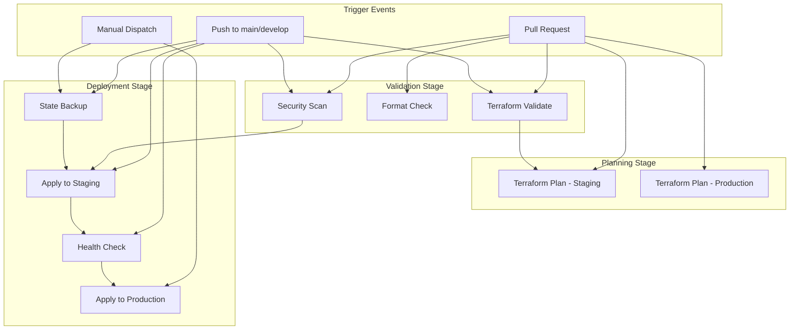

# CI/CD Integration Guide

This guide provides comprehensive documentation for the automated Terraform CI/CD pipeline implementation.

## 🎯 Overview

The CI/CD pipeline provides fully automated infrastructure management with:
- **Automated validation** on pull requests
- **Security scanning** with Checkov
- **Environment-specific deployments** with approval gates
- **State management** with automated backups
- **Health checks** and rollback capabilities

## 🏗️ Pipeline Architecture



## 🔧 Pipeline Configuration

### GitHub Actions Workflow

Located at: `.github/workflows/terraform.yml`

#### Jobs Overview

| Job | Trigger | Purpose | Duration |
|-----|---------|---------|----------|
| `terraform-validate` | PR, Push | Code validation & formatting | 2-3 min |
| `terraform-security-scan` | PR, Push | Security vulnerability scanning | 3-5 min |
| `terraform-plan` | PR, Manual | Generate deployment plans | 5-8 min |
| `terraform-apply` | Push to main, Manual | Deploy infrastructure | 8-15 min |
| `terraform-destroy` | Manual only | Destroy infrastructure | 5-10 min |

#### Environments Configuration

The pipeline supports three environments with different characteristics:

**Development Environment**
- **Auto-deploy**: Enabled on develop branch
- **Approval**: Not required
- **Resources**: Minimal (shared plans, single instances)
- **Backups**: 7-day retention

**Staging Environment** 
- **Auto-deploy**: Enabled on main branch
- **Approval**: Not required
- **Resources**: Standard (mirrors production but smaller)
- **Backups**: 14-day retention

**Production Environment**
- **Auto-deploy**: Disabled (manual approval required)
- **Approval**: Required via GitHub Environment protection
- **Resources**: High availability, auto-scaling enabled
- **Backups**: 30-day retention, point-in-time recovery

## 🔐 Secrets Management

### Required GitHub Secrets

Configure these secrets in your GitHub repository:

#### Core Provider Secrets
```bash
# Terraform Providers
CLOUDFLARE_API_TOKEN=your-cloudflare-api-token
RENDER_API_KEY=your-render-api-key
GCP_SERVICE_ACCOUNT_JSON={"type": "service_account", ...}

# Provider Configuration
CLOUDFLARE_ZONE_ID=your-zone-id
CLOUDFLARE_ACCOUNT_ID=your-account-id
GCP_PROJECT_ID=your-gcp-project-id
```

#### Application Secrets
```bash
# Authentication
API_SECRET_KEY=your-production-secret-key
GOOGLE_CLIENT_ID=your-google-client-id.apps.googleusercontent.com
GOOGLE_CLIENT_SECRET=your-google-client-secret

# reCAPTCHA
RECAPTCHA_SITE_KEY=your-recaptcha-site-key
RECAPTCHA_SECRET=your-recaptcha-secret

# External Services
ASSEMBLYAI_API_KEY=your-assemblyai-api-key
MONITORING_EMAIL=alerts@yourcompany.com
```

#### ECPay Payment Configuration
```bash
# ECPay Integration
ECPAY_MERCHANT_ID=your-merchant-id
ECPAY_HASH_KEY=your-hash-key
ECPAY_HASH_IV=your-hash-iv

# Admin Security
ADMIN_WEBHOOK_TOKEN=strong-random-token-32-chars
```

### Secret Security Best Practices

1. **Rotation Schedule**
   - API tokens: Every 90 days
   - Secret keys: Every 180 days
   - Payment credentials: Per ECPay requirements

2. **Access Control**
   - Use GitHub Environment protection rules
   - Limit secret access to specific workflows
   - Enable audit logging for secret usage

3. **Validation**
   - Secrets are validated during pipeline execution
   - Invalid secrets will fail the deployment early
   - Use dry-run modes to test secret configuration

## 🚀 Deployment Workflows

### Pull Request Workflow

When a PR is created or updated:

1. **Validation Jobs Run**
   ```yaml
   - Terraform format check
   - Terraform validation (all environments)
   - Script syntax validation
   - Security scanning with Checkov
   ```

2. **Planning Jobs Execute**
   ```yaml
   - Generate plans for staging and production
   - Upload plans as artifacts
   - Comment plan summaries on PR
   ```

3. **Review Process**
   - Developers review Terraform plans in PR comments
   - Security scan results appear in GitHub Security tab
   - Merge only after approval and passing checks

### Main Branch Deployment

When code is pushed to main branch:

1. **Validation & Security**
   - All validation jobs must pass
   - Security scan must show no critical issues

2. **Staging Deployment**
   - Automatic state backup creation
   - Apply Terraform changes to staging
   - Run post-deployment health checks
   - Generate deployment report

3. **Production Readiness**
   - Production deployment plan is available
   - Manual approval gate prevents auto-deployment

### Manual Production Deployment

Using GitHub Actions manual trigger:

1. **Navigate to Actions tab**
2. **Select "Infrastructure CI/CD" workflow**
3. **Click "Run workflow"**
4. **Configure deployment**:
   ```
   Environment: production
   Action: apply
   ```
5. **Review and approve** through GitHub Environment protection

## 📊 Monitoring and Observability

### Deployment Monitoring

The pipeline provides comprehensive monitoring at multiple levels:

#### 1. Pipeline Execution Monitoring
```yaml
# Built-in GitHub Actions monitoring
- Job execution times and success rates
- Resource usage and cost tracking
- Error rates and failure patterns
- Deployment frequency metrics
```

#### 2. Infrastructure Health Checks
```bash
# Post-deployment validation
- Frontend accessibility tests
- API health endpoint verification  
- Database connectivity validation
- Service response time monitoring
```

#### 3. State Management Monitoring
```bash
# Terraform state monitoring
- State file integrity checks
- Resource drift detection
- Backup success/failure tracking
- State size and complexity metrics
```

### Alerting Configuration

#### GitHub Notifications
- **Failed deployments**: Immediate Slack/email notification
- **Security vulnerabilities**: Weekly summary report
- **State backup failures**: Daily notification
- **Drift detection**: Bi-weekly drift reports

#### External Monitoring Integration
```yaml
# Integration points
- Sentry for error tracking
- DataDog for infrastructure metrics
- PagerDuty for critical alerts
- Slack for deployment notifications
```

## 🛠️ Troubleshooting Guide

### Common Issues and Solutions

#### 1. Authentication Failures
```bash
# Error: could not find default credentials
Solution:
1. Verify GCP_SERVICE_ACCOUNT_JSON is valid JSON
2. Check service account has required IAM roles
3. Ensure project ID matches the service account project

# Commands to verify:
gcloud auth activate-service-account --key-file=service-account.json
gcloud projects get-iam-policy PROJECT_ID
```

#### 2. State Lock Issues
```bash
# Error: state locked
Solution:
1. Check for running deployments in GitHub Actions
2. Wait for concurrent operations to complete
3. If stuck, use force-unlock carefully:
   terraform force-unlock LOCK_ID

# Prevention:
- Avoid manual terraform commands during CI/CD
- Use pipeline for all infrastructure changes
```

#### 3. Plan/Apply Mismatches
```bash
# Error: plan file is stale
Solution:
1. Plans are automatically regenerated in apply jobs
2. For manual operations, always run fresh plan:
   ./scripts/plan.sh production
   ./scripts/deploy.sh production

# Best practice: 
- Don't reuse plans older than 1 hour
- Let CI/CD handle plan generation
```

#### 4. Resource Conflicts
```bash
# Error: resource already exists
Solution:
1. Import existing resources:
   terraform import module.cloudflare.cloudflare_record.api RECORD_ID

2. Remove from state if no longer needed:
   terraform state rm module.cloudflare.cloudflare_record.api

3. Check for manual resource creation outside Terraform
```

#### 5. Deployment Failures
```bash
# Health check failures after deployment
Troubleshooting steps:
1. Check deployment logs in GitHub Actions
2. Verify service status in provider dashboards
3. Run manual health checks:
   curl -f https://api.yourdomain.com/health
   
4. Rollback if necessary:
   ./scripts/restore-state.sh backup-file environment
```

### Debug Mode

Enable detailed logging for troubleshooting:

```yaml
# Add to workflow environment variables
TF_LOG: DEBUG
TF_LOG_PATH: ./terraform-debug.log

# Or run locally with debug
export TF_LOG=DEBUG
./scripts/deploy.sh production
```

## 📈 Performance Optimization

### Pipeline Speed Optimization

#### 1. Parallel Execution
```yaml
# Current parallel jobs:
- Validation jobs run concurrently
- Multi-environment planning in matrix
- Independent security scanning

# Optimization opportunities:
- Cache Terraform providers
- Use smaller GitHub runners for validation
- Optimize Docker layer caching
```

#### 2. Resource Optimization
```yaml
# Current resource usage:
- Standard GitHub runners (2 cores, 7GB RAM)
- Provider downloads: ~200MB per job
- State downloads: <10MB per environment

# Optimizations:
- Use terraform-cache action for providers
- Compress artifacts and logs
- Clean up temporary files
```

#### 3. Network Optimization
```yaml
# Current network calls:
- Provider API calls: ~50-100 per deployment
- State backend calls: ~10-20 per operation
- Health check calls: ~5-10 per environment

# Optimizations:
- Batch API calls where possible
- Use efficient polling intervals
- Implement circuit breakers for external calls
```

### Cost Optimization

#### 1. Runner Cost Management
```yaml
# Cost factors:
- Runner minutes: ~15 minutes per full deployment
- Storage: ~100MB artifacts per run
- Network: ~500MB transfer per deployment

# Optimizations:
- Use scheduled deployments during off-hours
- Implement deployment batching
- Clean up old artifacts automatically
```

#### 2. Resource Cost Management
```yaml
# Monitoring tools:
- Enable GCP cost monitoring
- Set up Cloudflare usage alerts
- Monitor Render resource utilization

# Automation:
- Auto-scale development resources to zero
- Schedule staging environment shutdowns
- Implement resource tagging for cost allocation
```

## 🔒 Security Best Practices

### Infrastructure Security

#### 1. Secret Management
- **Never commit secrets** to repository
- **Use GitHub encrypted secrets** for sensitive data
- **Implement secret rotation** schedules
- **Audit secret access** regularly

#### 2. Access Control
- **Use least privilege** IAM policies
- **Enable MFA** for admin accounts  
- **Implement environment protection** rules
- **Regular access reviews** quarterly

#### 3. Network Security
- **Enable WAF rules** on Cloudflare
- **Use private endpoints** where possible
- **Implement IP whitelisting** for admin access
- **Monitor for unusual traffic** patterns

### Pipeline Security

#### 1. Code Security
```yaml
# Implemented security checks:
- Checkov static analysis
- Secret scanning
- Dependency vulnerability scanning
- Infrastructure drift detection

# Additional recommendations:
- Enable branch protection rules
- Require signed commits
- Use dependabot for updates
- Implement code review requirements
```

#### 2. Deployment Security
```yaml
# Current security measures:
- Environment-based approvals
- State backup before changes
- Health checks after deployment
- Rollback capabilities

# Enhanced security:
- Implement deployment windows
- Add change approval workflows
- Enable deployment logging
- Monitor for unauthorized changes
```

## 📚 Operational Procedures

### Regular Maintenance Tasks

#### Weekly Tasks
- [ ] Review deployment success rates
- [ ] Check for security vulnerabilities
- [ ] Validate backup integrity
- [ ] Monitor resource utilization

#### Monthly Tasks  
- [ ] Rotate service account keys
- [ ] Update Terraform providers
- [ ] Review and optimize costs
- [ ] Test disaster recovery procedures

#### Quarterly Tasks
- [ ] Comprehensive security audit
- [ ] Performance benchmarking
- [ ] Documentation updates
- [ ] Team training on new features

### Incident Response

#### Deployment Failure Response
1. **Immediate Actions** (0-5 minutes)
   - Stop any running deployments
   - Assess impact scope
   - Notify stakeholders

2. **Investigation** (5-30 minutes)
   - Review deployment logs
   - Check service health status
   - Identify root cause

3. **Recovery** (30-60 minutes)
   - Execute rollback if necessary
   - Restore services to working state
   - Verify system functionality

4. **Post-Incident** (1-24 hours)
   - Document incident details
   - Implement preventive measures
   - Update runbooks and procedures

### Emergency Procedures

#### Complete Infrastructure Loss
```bash
# Recovery steps:
1. Initialize fresh environment
   ./scripts/setup-backend.sh PROJECT_ID

2. Restore from latest backup
   ./scripts/restore-state.sh latest-backup.tfstate production

3. Validate and apply configuration
   ./scripts/validate.sh production
   ./scripts/deploy.sh production

4. Run comprehensive health checks
   ./scripts/health-check.sh production
```

#### State Corruption
```bash
# Recovery procedure:
1. Stop all operations
2. Create emergency backup
   gsutil cp gs://bucket/env/default.tfstate emergency-backup.tfstate
   
3. Restore from last known good backup
   ./scripts/restore-state.sh last-good-backup.tfstate production
   
4. Rebuild corrupted resources if needed
   terraform apply -target=module.affected_module
```

## 📖 Additional Resources

### Documentation Links
- [Terraform Best Practices](https://www.terraform-best-practices.com/)
- [GitHub Actions Documentation](https://docs.github.com/en/actions)
- [Cloudflare Terraform Provider](https://registry.terraform.io/providers/cloudflare/cloudflare/latest/docs)
- [Render Terraform Provider](https://registry.terraform.io/providers/render-oss/render/latest/docs)

### Internal Documentation
- [Deployment Guide](./DEPLOYMENT_GUIDE.md)
- [Security Management](./SECURITY_MANAGEMENT.md)
- [Terraform Architecture](./TERRAFORM_ARCHITECTURE.md)
- [Environment Variables](../terraform/ENVIRONMENT_VARIABLES.md)

### Support Channels
- **GitHub Issues**: Repository issue tracker
- **Slack Channel**: #infrastructure-alerts
- **Documentation Wiki**: Internal team wiki
- **Runbooks**: operations/runbooks/

---

**Last Updated**: 2025-08-30  
**Version**: v1.0  
**Status**: ✅ **Implemented and Operational**