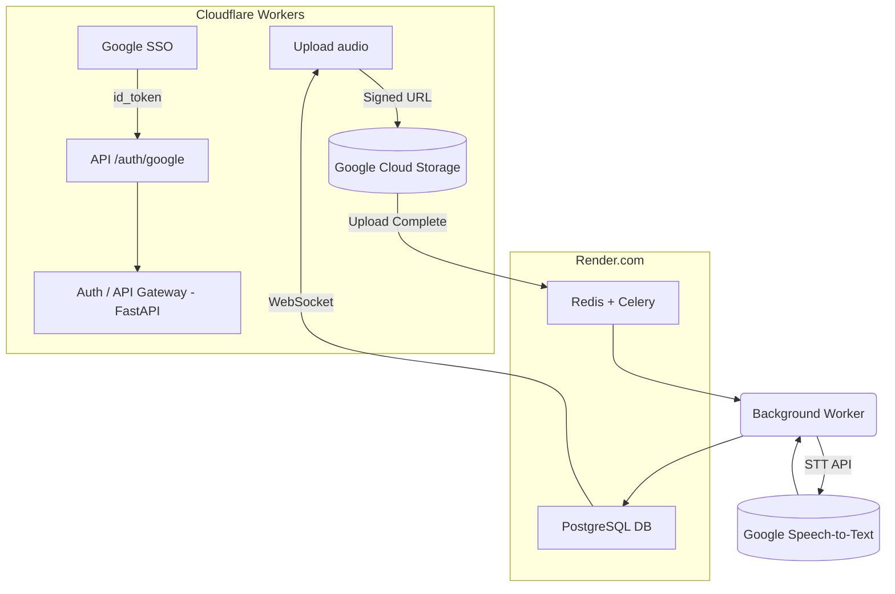

# Coach Assistant MVP Design Document (v1.1)

## 1. 專案目標

* **使用者族群**：ICF 教練（從學習者到執業者）。
* **核心價值**：快速、低成本地將 1 hr 內之會談錄音 → 高品質逐字稿，並保留日後 AI 評分與督導擴充性。
* **MVP 功能**

  1. Google SSO 註冊／登入。
  2. 上傳音檔（≤ 60 min）；自動語音轉文字。
  3. 支援自動分離說話人 (speaker diarization)；事後可指定「Coach／Client」。
  4. 轉檔完即刪除音檔；僅存字幕與中繼資料。

---

## 2. 功能需求

| 需求編號   | 敘述                                      | 優先度 |
| ------ | --------------------------------------- | --- |
| FR‑01  | 使用者可透過 Google 帳號註冊／登入                   | ★★★ |
| FR‑02  | 上傳單檔 ≤ 500 MB（建議 mp3 128 kbps）          | ★★★ |
| FR‑03  | 60 min 內返回逐字稿 (JSON / VTT / SRT)        | ★★★ |
| FR‑04  | 自動偵測說話人；UI 允許手動標註角色                     | ★★☆ |
| NFR‑01 | P95 轉檔延遲 ≤ 4 × 實際長度                     | ★★☆ |
| NFR‑02 | 成本可水平擴充；1 k 教練 / 月 10 hr 仍維持毛利率 50 % 以上 | ★★☆ |
| NFR‑03 | GDPR、台灣個資法相容；音檔 24 h 自毀                 | ★★★ |

---

## 3. 高階架構 (Mermaid)



---

## 4. 元件明細

| 元件                         | 技術                                      | 關鍵設定                                                      |
| -------------------------- | --------------------------------------- | --------------------------------------------------------- |
| **Frontend**               | Next.js 14 + Tailwind on Cloudflare Workers | SWR + JWT refresh；Transcript Viewer (React Player + 字幕高亮) |
| **API Gateway**            | FastAPI on Render.com                   | OAuth2 Bearer；CORS；Rate‑limit (SlowAPI)                   |
| **Task Queue**             | Celery + Redis (Render Redis)           | `concurrency = 2 × vCPU`；Retry 3 次 backoff                |
| **STT Provider Interface** | Google Speech-to-Text v2                | `transcribe()` ↦ `TranscriptResult`；內建 speaker diarization |
| **Database**               | PostgreSQL (Render) → SQLAlchemy ORM    | Repository Pattern；Alembic migration                      |
| **Storage**                | Google Cloud Storage `coaching-audio`   | Lifecycle Rule：`age = 1` day                              |
| **Messaging**              | Polling-based status check              | 背景任務狀態輪詢                                               |
| **Monitoring**             | Render Metrics + Custom logging         | Custom metrics：`transcript_latency_sec`, `stt_cost_usd`   |

---

## 5. 資料模型

```python
class User(BaseModel):
    id: UUID
    email: EmailStr
    name: str
    avatar_url: HttpUrl
    created_at: datetime

class Session(BaseModel):
    id: UUID
    user_id: UUID
    title: str
    started_at: datetime
    duration_sec: int
    language: str = "auto"
    created_at: datetime

class TranscriptSegment(BaseModel):
    id: UUID
    session_id: UUID
    speaker_id: int  # 1,2,3…
    start_sec: float
    end_sec: float
    content: str
```

> **遷移策略**：使用 Repository Pattern 抽象化資料存取；未來遷移到 Cloud SQL + Firestore 只需實作新的 Repository 類別。

---

## 6. REST / WebSocket API 摘要

| Method | Path                                   | 描述                     |
| ------ | -------------------------------------- | ---------------------- |
| POST   | `/auth/google`                         | 交換 `id_token` → JWT    |
| POST   | `/sessions`                            | 建立 Session (meta)      |
| POST   | `/sessions/{id}/upload-url`            | 產生簽名上傳 URL             |
| PATCH  | `/sessions/{id}/roles`                 | 指定 `speaker_id → role` |
| GET    | `/sessions/{id}/transcript?format=vtt` | 下載字幕                   |
| WS     | `/ws/progress/{session_id}`            | 實時推播轉檔進度               |

---

## 7. STT 方案比較

| 指標                  | OpenAI Whisper API | Google Speech‑to‑Text v2       |
| ------------------- | ------------------ | ------------------------------ |
| 價格                  | US \$0.006 / min   | US \$0.016 / min (0–500 k)     |
| Speaker Diarization | 外掛 (pyannote)      | 內建 `speaker_tag`               |
| Phrase Hint         | 無                  | `phrase_hints`, `custom_class` |
| 成本優勢                | ★★★★★              | ★★☆☆☆                          |
| GCS 整合              | 需下載檔案           | 直接讀取 GCS                    |

**決策**

* MVP 用 **Google Speech-to-Text** 善用 GCS 整合優勢和內建 diarization 功能。
* 保留 `OpenAISTTClient` 介面，未來可提供低成本選項給用戶選擇。
* 利用 Google 生態系整合，為未來遷移到 Cloud Run 做準備。

---

## 8. Speaker → Role 指派流程

1. STT 回傳含 `speaker_id`。
2. 後端將相同 `speaker_id` 連續詞句 merge → `TranscriptSegment`。
3. 前端顯示「說話人 1 / 2 …」，下拉選 `Coach`、`Client`。
4. `PATCH /sessions/{id}/roles` 寫入 `session_roles`。
5. 查詢時 join role；字幕 UI 顯示 **Coach：** / **Client：**。

---

## 9. 成本與定價試算

| 項目 | 成本 | 月使用量 | 建議收費 (NT$) | 毛利 |
|------|------|----------|---------------|------|
| **基礎設施成本** |
| Render Web Service | $7 | - | - | - |
| Render PostgreSQL | $7 | - | - | - |
| Google Cloud Storage | ~$1 | 1000 小時音檔 | - | - |
| **STT 成本 (Google)** |
| 60 min / 月 (免費) | $0.96 | | 0 | — |
| 10 hr / 月 | $9.60 | | 599 (Pro) | ≈ 78% |
| 100 hr / 月 | $96.00 | | 4,900 企業包 | ≈ 70% |

**總營運成本**: ~$15/月 固定 + 變動 STT 成本  
**優勢**: 內建 speaker diarization，無需額外收費

---

## 10. 部署設定

### Render 設定

```yaml
# render.yaml - Render Blueprint
services:
  - type: web
    name: coach-api
    env: python
    buildCommand: "pip install -r requirements.txt"
    startCommand: "uvicorn main:app --host 0.0.0.0 --port $PORT"
    envVars:
      - key: DATABASE_URL
        fromDatabase:
          name: coach-db
          property: connectionString
      - key: REDIS_URL
        fromService:
          name: coach-redis
          type: redis
          property: connectionString
      - key: GOOGLE_APPLICATION_CREDENTIALS_JSON
        fromGroup: google-cloud

databases:
  - name: coach-db
    databaseName: coaching_assistant
    user: coach_user

  - name: coach-redis
    ipAllowList: []
```

### Google Cloud Storage 設定

```python
# config/gcs_setup.py
from google.cloud import storage

def setup_audio_bucket(project_id: str, bucket_name: str):
    client = storage.Client(project=project_id)
    
    bucket = client.bucket(bucket_name)
    bucket.lifecycle_rule = {
        'action': {'type': 'Delete'},
        'condition': {'age': 1}  # 1 day
    }
    bucket.patch()
    
    return bucket
```

---

## 11. CI/CD（GitHub Actions + Render）

```yaml
# .github/workflows/deploy.yml
name: Deploy to Render
on:
  push:
    branches: [main]

jobs:
  deploy:
    runs-on: ubuntu-latest
    steps:
      - uses: actions/checkout@v3
      - name: Trigger Render Deploy
        run: |
          curl -X POST \
            -H "Authorization: Bearer ${{ secrets.RENDER_API_KEY }}" \
            -H "Content-Type: application/json" \
            -d '{"serviceId": "${{ secrets.RENDER_SERVICE_ID }}"}' \
            https://api.render.com/v1/services/${{ secrets.RENDER_SERVICE_ID }}/deploys

  test:
    runs-on: ubuntu-latest
    steps:
      - uses: actions/checkout@v3
      - name: Setup Python
        uses: actions/setup-python@v4
        with:
          python-version: '3.11'
      - name: Install dependencies
        run: |
          pip install -r apps/api-server/requirements.txt
      - name: Run tests
        run: |
          pytest packages/core-logic/tests/
```

---

## 12. 安全與法遵

| 風險          | 對策                                              |
| ----------- | ----------------------------------------------- |
| 音檔含個資       | 24 h Lifecycle Delete；全程 TLS；SA 權限最小化           |
| API Key 洩漏  | Render 環境變數；Google SA 僅有必要權限                   |
| GDPR / 台灣個資 | `DELETE /sessions/{id}` 提供刪除權；資料留存政策明確告知        |
| 費用爆衝        | Render 資源限制；自訂指標 `stt_cost_usd` 監控             |

---

## 13. Roadmap (6 mo)

| Quarter | 里程碑                                                  |
| ------- | ---------------------------------------------------- |
| Q1      | MVP 上線；導入 Stripe / NewebPay；邀請 β 用戶 50 人             |
| Q2      | AI 評分 (PCC Marker)；引入 pay‑as‑you‑go 計費               |
| Q3      | 遷移到 Cloud Run；企業帳號 (多 Coach)；Slack / Teams Bot 整合   |
| Q4      | 督導 Marketplace；行銷整合 (Mailchimp)                      |

---

## 14. 結語

* **Google Speech-to-Text** 為 MVP 功能與成本的最佳平衡解；內建 diarization 功能降低開發複雜度。
* **Render + GitHub Actions** 提供快速部署與持續整合；PostgreSQL → Cloud SQL 的遷移透過 Repository Pattern 實現。
* Freemium + Pro 月租 + 超額按量計價，可在毛利率 70% 以上同時降低新手入門門檻。

---

> 若需擴充任何章節，或希望加入更細的實作範例，請在對話中提出，我們再迭代更新！
