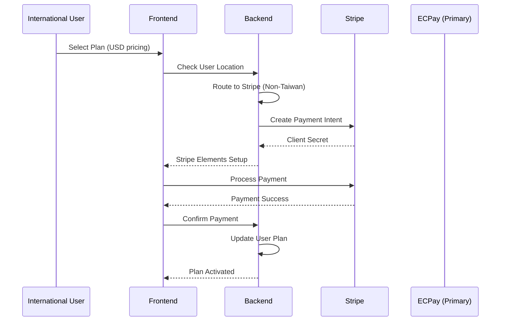

# Stripe Integration - Secondary/Future Implementation

## 📋 Overview
This document outlines Stripe integration as a **secondary, lower-priority** payment provider for international expansion, implemented only after ECPay Taiwan market success.

## 🎯 Strategic Position: International Expansion

### Why Stripe is Secondary
- **Market Priority**: Taiwan market first (ECPay), international second
- **User Base**: <5% international users currently
- **Complexity**: Additional provider adds maintenance overhead
- **ROI**: Taiwan market ROI higher with local payment methods
- **Development Resources**: Focus limited resources on primary market first

### Stripe Implementation Triggers
- ✅ **ECPay fully operational** with >90% Taiwan conversion
- ✅ **International user requests** >20% of support tickets
- ✅ **Revenue target met** from Taiwan market
- ✅ **Product-market fit** established in Taiwan
- ⏳ **International marketing** campaign planned

## 🏗️ Stripe Integration Architecture (Future)

### Stripe as Secondary Provider


### Provider Selection Logic
```python
# Multi-provider routing (future implementation)
class PaymentProviderRouter:
    def select_provider(self, user: User) -> str:
        """Select payment provider based on user profile"""
        
        # Primary: ECPay for Taiwan users
        if self.is_taiwan_user(user):
            return "ecpay"
        
        # Secondary: Stripe for international users  
        if self.is_international_user(user):
            return "stripe"
        
        # Default: ECPay (Taiwan market focus)
        return "ecpay"
    
    def is_taiwan_user(self, user: User) -> bool:
        """Check if user is from Taiwan"""
        return (
            user.country_code == "TW" or
            user.preferred_currency == "TWD" or 
            user.locale == "zh-TW"
        )
    
    def is_international_user(self, user: User) -> bool:
        """Check if user needs international payment options"""
        international_countries = ["US", "GB", "AU", "CA", "EU"]
        return user.country_code in international_countries
```

## 📊 Implementation Phases (Future)

### Phase 1: Market Validation (After ECPay Success)
- [ ] Analyze international user requests
- [ ] Validate demand for USD pricing
- [ ] Research international coaching market
- [ ] Cost-benefit analysis for Stripe integration

### Phase 2: Technical Preparation (6+ months out)
```python
# Extend existing ECPay architecture for multi-provider support
class MultiProviderPaymentService:
    def __init__(self):
        self.ecpay_service = ECPayService()  # Primary
        self.stripe_service = StripeService()  # Secondary
    
    def create_payment(self, user: User, plan: str, provider: str = None):
        """Create payment using specified or auto-selected provider"""
        if not provider:
            provider = PaymentProviderRouter().select_provider(user)
        
        if provider == "ecpay":
            return self.ecpay_service.create_payment_order(...)
        elif provider == "stripe":
            return self.stripe_service.create_payment_intent(...)
```

### Phase 3: Limited International Launch
- [ ] Stripe account setup and verification
- [ ] USD pricing tier creation
- [ ] International payment form (English)
- [ ] Limited beta testing with international users

### Phase 4: Full International Support
- [ ] Multi-currency support (USD, EUR, GBP)
- [ ] International tax handling
- [ ] Global payment method optimization
- [ ] International customer support

## 💰 International Pricing Strategy (Future)

### USD Pricing Tiers (When Implemented)
```python
# International pricing (secondary market)
INTERNATIONAL_PRICING = {
    "FREE": {
        "price_usd": 0,
        "display": "Free",
        "features": ["60MB files", "Basic transcription", "3 sessions"]
    },
    "PRO": {
        "price_usd": 2900,  # $29/month (competitive with international SaaS)
        "price_annual_usd": 29900,  # $299/year (save $49)
        "display": "$29/month",
        "features": ["200MB files", "Advanced transcription", "Unlimited sessions"]
    },
    "ENTERPRISE": {
        "price_usd": 9900,  # $99/month
        "price_annual_usd": 99900,  # $999/year
        "display": "$99/month", 
        "features": ["500MB files", "Enterprise features", "Priority support"]
    }
}
```

### Market Research Required
- [ ] **Competitor Analysis**: Otter.ai ($16.99), Rev.ai ($22), Fireflies.ai ($18)
- [ ] **Value Proposition**: Coaching-specific features vs general transcription
- [ ] **Currency Strategy**: USD primary, EUR/GBP secondary
- [ ] **Tax Compliance**: VAT, sales tax handling

## 🔧 Technical Implementation (Future)

### Stripe Service Architecture
```python
# Future Stripe implementation (low priority)
class StripeService:
    """Stripe payment service for international users"""
    
    def __init__(self):
        self.stripe_key = settings.STRIPE_SECRET_KEY
        self.webhook_secret = settings.STRIPE_WEBHOOK_SECRET
    
    def create_payment_intent(
        self, 
        amount_usd: int, 
        user_id: str, 
        plan_name: str
    ) -> Dict[str, Any]:
        """Create Stripe payment intent for international users"""
        return {
            "client_secret": "pi_xxx_secret_xxx",
            "amount": amount_usd,
            "currency": "usd",
            "payment_methods": ["card"]
        }
    
    def handle_webhook(self, payload: str, signature: str) -> bool:
        """Process Stripe webhook events"""
        # Handle payment succeeded, failed, subscription events
        pass
```

### Database Schema Extensions (Future)
```sql
-- Extend existing tables for multi-provider support
ALTER TABLE payment_providers ADD COLUMN priority INTEGER DEFAULT 0;
ALTER TABLE payment_providers ADD COLUMN target_markets JSONB;

-- Update ECPay as primary (priority 1)
UPDATE payment_providers 
SET priority = 1, target_markets = '["TW"]' 
WHERE name = 'ecpay';

-- Add Stripe as secondary (priority 2) when ready
INSERT INTO payment_providers (name, display_name, priority, target_markets, supported_currencies)
VALUES ('stripe', 'Stripe', 2, '["US", "EU", "GB", "AU"]', '["USD", "EUR", "GBP"]');
```

### Frontend Components (Future)
```tsx
// Future international payment components
components/payment/ProviderSelector.tsx      // Choose ECPay vs Stripe
components/payment/StripePaymentForm.tsx     // Stripe Elements integration
components/payment/CurrencySelector.tsx      // TWD vs USD selection
components/payment/InternationalPricing.tsx  // USD pricing display
```

## ⚠️ Stripe Implementation Risks

### Technical Risks
- **Complexity**: Multi-provider architecture increases bugs
- **Maintenance**: Two payment systems to maintain and update
- **Testing**: Double the payment testing requirements
- **Security**: Two PCI compliance requirements

### Business Risks
- **Resource Dilution**: Focus away from profitable Taiwan market
- **Lower ROI**: International conversion typically lower than local
- **Support Complexity**: Multiple payment support flows
- **Currency Risk**: USD/TWD exchange rate fluctuations

### Mitigation Strategies
- **Phased Approach**: Only implement after Taiwan success
- **Market Validation**: Prove international demand first
- **Technical Debt**: Ensure ECPay architecture is solid first
- **Resource Allocation**: Dedicated team for international expansion

## 📈 Success Criteria (Before Stripe Implementation)

### ECPay Taiwan Success Metrics
- [ ] **Payment Success Rate**: >95% for all Taiwan payment methods
- [ ] **Market Penetration**: >1000 active Taiwan subscribers
- [ ] **Revenue Target**: NT$500,000+ monthly recurring revenue
- [ ] **Customer Satisfaction**: <2% payment-related issues
- [ ] **Conversion Rate**: >85% upgrade completion rate

### International Demand Indicators
- [ ] **User Requests**: >50 monthly requests for international payment
- [ ] **Market Research**: Validated international coaching market
- [ ] **Competition Analysis**: Competitive advantage identified
- [ ] **Pricing Research**: International pricing strategy validated

## 🔮 Future Roadmap

### 2024 Q4: ECPay Optimization (Current Priority)
- Complete ECPay integration
- Optimize Taiwan conversion rates
- Perfect Traditional Chinese UX
- Achieve product-market fit in Taiwan

### 2025 Q1: International Assessment
- Analyze international user demand
- Research global coaching market
- Evaluate Stripe integration ROI
- Plan international expansion strategy

### 2025 Q2: Stripe Development (If Validated)
- Begin Stripe integration planning
- Develop multi-provider architecture
- Create international pricing strategy
- Implement USD payment flows

### 2025 Q3: International Launch (If Successful)
- Limited beta with international users
- Full Stripe payment integration
- International marketing campaign
- Global customer support

---

**Current Priority**: Complete ECPay Taiwan integration before any Stripe work  
**Future Consideration**: Stripe implementation only after proven Taiwan market success  
**Resource Allocation**: 100% focus on ECPay until Taiwan targets achieved