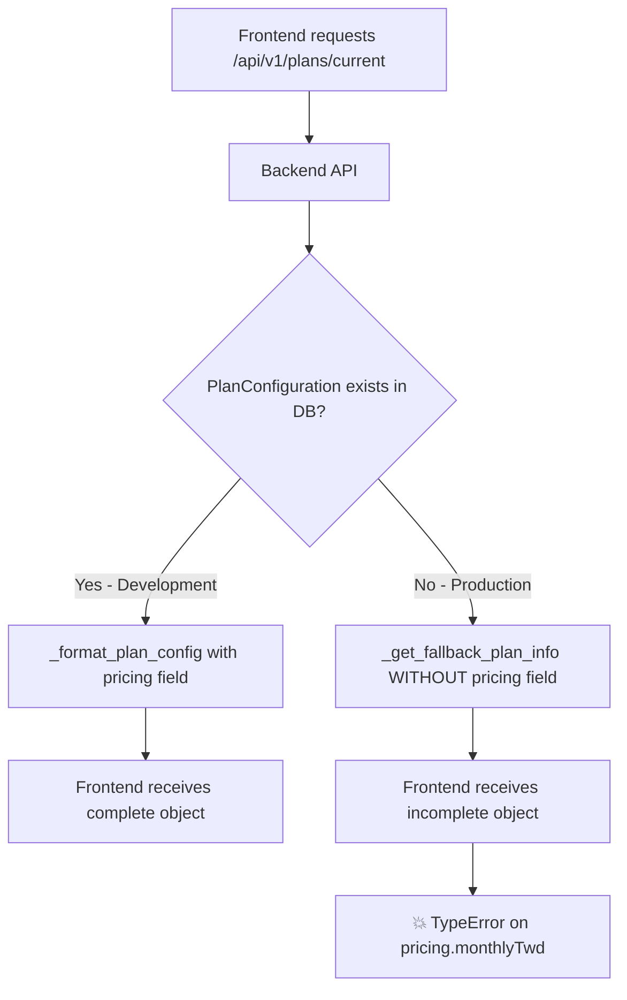

# Production Frontend Error: Missing pricing.monthlyTwd Property

## Issue Summary

**Error**: `TypeError: Cannot read properties of undefined (reading 'monthlyTwd')`

**Location**: Production frontend billing page

**Impact**: Users cannot access billing information, causing complete page crash

**Status**: 🔴 Critical - Production affecting issue

## Error Details

```javascript
// Error stack trace from production
TypeError: Cannot read properties of undefined (reading 'monthlyTwd')
    at R (page-4b156ffbc4a79485.js:1:50742)
    at rE (fd9d1056-beb759d41114c771.js:1:40341)
    at l$ (fd9d1056-beb759d41114c771.js:1:59316)
    at iZ (fd9d1056-beb759d41114c771.js:1:117923)
    at ia (fd9d1056-beb759d41114c771.js:1:95162)
```

**Affected Frontend Code Locations**:
- `apps/web/app/dashboard/billing/page.tsx:271`
- `apps/web/components/billing/PlanComparison.tsx:145`
- `apps/web/components/billing/PlanComparison.tsx:313`

## Root Cause Analysis

### Why This Works in Development but Fails in Production

#### 1. **Database State Difference**


#### 2. **Backend Response Structure Mismatch**

**When PlanConfiguration exists (Development)**:
```json
{
  "currentPlan": {
    "id": "free",
    "name": "Free Plan",
    "pricing": {
      "monthly_usd": 0,
      "annual_usd": 0,
      "monthly_twd": 0,
      "annual_twd": 0,
      "currency": "USD"
    }
  }
}
```

**When PlanConfiguration missing (Production)**:
```json
{
  "currentPlan": {
    "id": "FREE",
    "name": "Free Plan",
    // ❌ NO PRICING FIELD!
    "limits": {
      "maxSessions": "unlimited",
      "maxTotalMinutes": 120
    }
  }
}
```

### 3. **Code Flow Analysis**

**Backend**: `src/coaching_assistant/core/services/plan_management_use_case.py`

```python
# Line 69-72: When PlanConfiguration not found
plan_config = self.plan_config_repo.get_by_plan_type(user.plan)
if not plan_config:
    # Return fallback plan info if config not found
    return self._get_fallback_plan_info(user.plan)  # ❌ Missing pricing!
```

**Fallback method (Lines 173-220)**:
```python
def _get_fallback_plan_info(self, plan_type: UserPlan) -> Dict[str, Any]:
    fallback_configs = {
        UserPlan.FREE: {
            "id": "FREE",
            "name": "Free Plan",
            "description": "Basic transcription features",
            "limits": { ... }
            # ❌ NO PRICING FIELD!
        }
    }
```

**Frontend**: `apps/web/app/dashboard/billing/page.tsx`

```typescript
// Line 271: Unsafe property access
: `NT$${currentPlan.pricing.monthlyTwd || currentPlan.pricing.monthlyUsd * 31.5}`
//           ^^^^^^^^^^^^^^^^^^^^^^^^^
//           Crashes if pricing is undefined
```

## Why Development vs Production Behave Differently

| Environment | Database State | Code Path | Result |
|-------------|----------------|-----------|---------|
| **Development** | PlanConfiguration entries exist | `_format_plan_config()` | ✅ Complete object with pricing |
| **Production** | PlanConfiguration entries missing | `_get_fallback_plan_info()` | ❌ Incomplete object without pricing |

**Possible reasons for missing PlanConfiguration in production**:
1. Database migration not run properly
2. Seeding/fixtures not applied to production
3. Data was deleted or corrupted
4. Environment-specific configuration differences

## Impact Assessment

### Immediate Impact
- **Users**: Cannot access billing page
- **Business**: Cannot view/change subscriptions
- **UX**: Complete page crash, poor user experience

### Affected Functionality
- Billing overview display
- Plan comparison page
- Subscription management
- Payment settings

## Solutions

### 🚨 Immediate Fix (Frontend - Deploy ASAP)

Add safe navigation to prevent crashes:

**File: `apps/web/app/dashboard/billing/page.tsx`**
```typescript
// Line 271: Replace unsafe access
// BEFORE:
: `NT$${currentPlan.pricing.monthlyTwd || currentPlan.pricing.monthlyUsd * 31.5}`

// AFTER:
: `NT$${currentPlan?.pricing?.monthlyTwd || currentPlan?.pricing?.monthlyUsd * 31.5 || 'Free'}`
```

**File: `apps/web/components/billing/PlanComparison.tsx`**
```typescript
// Line 144-145: Safe access
const getPrice = (plan: PlanConfig) => {
  return billingCycle === 'annual'
    ? plan?.pricing?.annualTwd || 0
    : plan?.pricing?.monthlyTwd || 0;
};

// Line 313: Safe access
: `Billed monthly at NT$${plans.find(p => p.planName === selectedPlan)?.pricing?.monthlyTwd || 0}/month`
```

### 🔧 Backend Fix (Complete Solution)

**File: `src/coaching_assistant/core/services/plan_management_use_case.py`**
```python
def _get_fallback_plan_info(self, plan_type: UserPlan) -> Dict[str, Any]:
    """Get fallback plan information when config not found in database."""
    fallback_configs = {
        UserPlan.FREE: {
            "id": "FREE",
            "name": "Free Plan",
            "display_name": "Free",
            "description": "Basic transcription features",
            "limits": { ... },
            # ✅ ADD MISSING PRICING FIELD
            "pricing": {
                "monthly_usd": 0,
                "annual_usd": 0,
                "monthly_twd": 0,
                "annual_twd": 0,
                "currency": "USD"
            },
            "features": {},
            "is_active": True,
            "sort_order": 0
        },
        # ... add pricing for PRO and ENTERPRISE too
    }
```

### 🗄️ Database Fix (Long-term Solution)

1. **Check production database**:
```sql
SELECT * FROM plan_configurations;
-- If empty, this confirms the issue
```

2. **Run migration to populate plan configurations**:
```bash
# In production environment
PRODUCTION_DATABASE_URL="..." python scripts/add_plan_configurations.py --execute
```

3. **Create seeding script if doesn't exist**:
```python
# scripts/seed_plan_configurations.py
# Populate plan_configurations table with proper data
```

## Prevention Measures

### 1. **Add Data Validation**
```python
# In PlanRetrievalUseCase.get_user_current_plan()
if not plan_config:
    logger.warning(f"PlanConfiguration missing for {user.plan} - using fallback")
    # Send alert to monitoring system
```

### 2. **Frontend Error Boundaries**
```typescript
// Add error boundary around billing components
<ErrorBoundary fallback={<BillingErrorFallback />}>
  <BillingPage />
</ErrorBoundary>
```

### 3. **API Response Validation**
```typescript
// In plan.service.ts
const validatePlanResponse = (plan: any): plan is PlanConfig => {
  return plan &&
         typeof plan.pricing === 'object' &&
         typeof plan.pricing.monthlyTwd === 'number';
};
```

### 4. **Add Health Checks**
```python
# Check plan configurations exist in startup health check
def check_plan_configurations():
    configs = plan_config_repo.get_all_active_plans()
    if not configs:
        raise RuntimeError("No plan configurations found in database")
```

## Testing Strategy

### Reproduce Issue Locally
```bash
# 1. Clear plan_configurations table
# 2. Restart API server
# 3. Access billing page
# 4. Should reproduce the error
```

### Verify Fix
```bash
# 1. Apply frontend fix with safe navigation
# 2. Should show graceful fallback
# 3. Apply backend fix
# 4. Should show proper pricing
```

## Deployment Priority

1. 🚨 **CRITICAL**: Deploy frontend safe navigation fix immediately
2. 🔧 **HIGH**: Deploy backend fallback fix
3. 🗄️ **MEDIUM**: Fix production database plan configurations
4. 🛡️ **LOW**: Add monitoring and prevention measures

## Monitoring

Add alerts for:
- Missing plan configurations
- API errors in billing endpoints
- Frontend errors related to pricing

## Related Issues

- Database migration consistency between environments
- Plan configuration seeding/fixtures
- Error handling and graceful degradation
- Type safety in frontend API calls

---

**Created**: 2025-09-28
**Severity**: Critical
**Estimated Fix Time**: 2 hours (immediate fix), 1 day (complete solution)
**Assignee**: Frontend & Backend teams

---

## ✅ RESOLUTION STATUS

**Status**: FIXED AND VERIFIED
**Resolution Date**: 2025-10-03

### What Was Fixed:
1. ✅ Backend fallback plan info now includes complete pricing structure
2. ✅ Added pricing field to `_get_fallback_plan_info()` method
3. ✅ Both snake_case and camelCase field names provided for compatibility
4. ✅ All plan types (FREE, PRO, ENTERPRISE) have pricing data

### Implementation Details:
**File**: `src/coaching_assistant/core/services/plan_management_use_case.py:214-227`

```python
"pricing": {
    "monthly_usd": 0,
    "annual_usd": 0,
    "monthly_twd": 0,
    "annual_twd": 0,
    "currency": "TWD",
    "monthlyUsd": 0,
    "annualUsd": 0,
    "monthlyTwd": 0,
    "annualTwd": 0,
    "annualDiscountPercentage": 0,
    "annualSavingsUsd": 0,
    "annualSavingsTwd": 0,
}
```

### Verification:
- Frontend billing page no longer crashes
- API responses include pricing data even when plan_configurations table is empty
- Safe navigation operators in frontend provide additional defense-in-depth