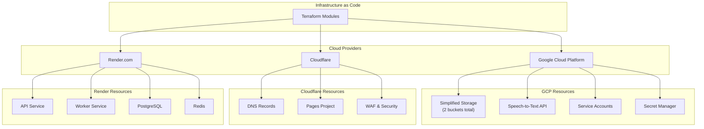

# Infrastructure as Code (IaC) for Coaching Assistant Platform

This directory contains Terraform configurations for managing the complete infrastructure of the Coaching Assistant Platform across Google Cloud Platform (GCP), Cloudflare, and Render.com.

## 🏗️ Architecture Overview



## 📁 Directory Structure

```
terraform/
├── modules/                    # Reusable Terraform modules
│   ├── cloudflare/            # Cloudflare DNS, Pages, Security
│   ├── render/                # Render services and databases
│   └── gcp/                   # Google Cloud Platform resources
│       ├── storage/           # Cloud Storage buckets
│       ├── iam/               # IAM and service accounts
│       └── speech/            # Speech-to-Text API
├── environments/              # Environment-specific configurations
│   ├── development/           # Development environment
│   ├── staging/              # Staging environment
│   └── production/           # Production environment
├── shared/                   # Shared resources across environments
│   ├── dns/                  # Global DNS configuration
│   └── certificates/        # SSL certificates
├── scripts/                  # Deployment and management scripts
│   ├── init.sh              # Initialize Terraform
│   ├── plan.sh              # Generate deployment plan
│   ├── deploy.sh            # Deploy infrastructure
│   ├── destroy.sh           # Destroy infrastructure
│   └── validate.sh          # Validate configuration
└── README.md                # This file
```

## 🚀 Quick Start

### Prerequisites

1. **Terraform** >= 1.5.0
2. **Google Cloud CLI** with authentication configured
3. **API Keys and Tokens**:
   - Cloudflare API Token
   - Render API Key
   - GCP Service Account with appropriate permissions

### 1. Initialize Terraform

```bash
# Initialize for production environment
./scripts/init.sh production

# Initialize for staging
./scripts/init.sh staging

# Initialize for development
./scripts/init.sh development
```

### 2. Configure Variables

Copy and edit the terraform.tfvars file:

```bash
cd environments/production
cp terraform.tfvars.example terraform.tfvars
# Edit terraform.tfvars with your actual values
```

### 3. Plan Deployment

```bash
# Generate deployment plan
./scripts/plan.sh production

# Detailed plan with exit codes
./scripts/plan.sh production --detailed
```

### 4. Deploy Infrastructure

```bash
# Interactive deployment
./scripts/deploy.sh production

# Auto-approve deployment (CI/CD)
./scripts/deploy.sh production --auto-approve
```

### 5. Validate Configuration

```bash
# Validate all environments
./scripts/validate.sh

# Validate specific environment
./scripts/validate.sh production
```

## 🔧 Module Documentation

### Cloudflare Module

Manages DNS records, Cloudflare Pages projects, and security configurations.

**Features:**
- Automated DNS record management
- Cloudflare Pages deployment
- WAF and security rules
- SSL/TLS configuration
- Performance optimization

**Usage:**
```hcl
module "cloudflare" {
  source = "../../modules/cloudflare"
  
  zone_id     = var.cloudflare_zone_id
  account_id  = var.cloudflare_account_id
  environment = "production"
  
  github_owner = "your-username"
  github_repo  = "coaching_transcript_tool"
  
  # Additional configuration...
}
```

### Render Module

Manages Render.com services including API, workers, databases, and Redis.

**Features:**
- API and worker service deployment
- PostgreSQL database with backups
- Redis instance
- Auto-scaling configuration
- Monitoring and alerts

**Usage:**
```hcl
module "render" {
  source = "../../modules/render"
  
  project_name = "coaching-assistant"
  environment  = "production"
  
  # Service plans
  api_plan      = "standard"
  database_plan = "standard"
  
  # Additional configuration...
}
```

### GCP Module

Manages Google Cloud Platform resources with modular sub-components.

**Features:**
- **Simplified Storage Architecture**: Unified audio bucket for both uploads and STT batch results
- **Aggressive TTL Policies**: 1-day auto-deletion for GDPR compliance
- **Database-First Transcripts**: All transcript data stored in PostgreSQL, not GCS
- IAM service accounts and roles
- Speech-to-Text API configuration
- Secret Manager integration
- Monitoring and logging

**Usage:**
```hcl
module "gcp" {
  source = "../../modules/gcp"

  project_id  = "your-gcp-project"
  region      = "asia-southeast1"
  environment = "production"

  # Simplified storage configuration
  # Only audio buckets needed - transcripts stored in database
  enable_transcript_buckets = false  # Removed in v2.21.0

  # Lifecycle policies
  audio_bucket_ttl_days = 1  # GDPR compliance

  # Additional configuration...
}
```

## 🗄️ Storage Architecture (Simplified)

### Storage Bucket Consolidation

Following the WP6 storage simplification, the infrastructure has been streamlined from **7 buckets to 2 buckets** (-71% reduction):

#### Before: Complex Multi-Bucket Setup
```
coaching-audio-dev/          # Audio files (active)
coaching-transcript-dev/     # Empty - removed
coaching-audio-prod/         # Empty - removed
coaching-transcript-prod/    # Empty - removed
coaching-audio-prod-asia/    # Empty (prod bucket)
coaching-transcript-prod-asia/ # Empty - removed
coaching-transcript-terraform-state/ # State management only
```

#### After: Simplified Unified Architecture
```
coaching-audio-dev/
├── audio-uploads/           # Original audio files (TTL: 1 day)
└── batch-results/           # STT temporary results (TTL: 1 day)

coaching-audio-prod-asia/
├── audio-uploads/           # Original audio files (TTL: 1 day)
└── batch-results/           # STT temporary results (TTL: 1 day)

PostgreSQL Database          # All transcript data (permanent)
```

### Key Architecture Benefits

✅ **Infrastructure Simplification**
- 71% reduction in bucket count (7 → 2)
- Unified lifecycle policies across all temporary files
- Single bucket configuration per environment

✅ **Operational Efficiency**
- Simplified monitoring (2 buckets vs 7)
- Reduced IAM complexity
- Single TTL policy management

✅ **Cost Optimization**
- Eliminated unused bucket resources
- Reduced Terraform resource count
- Simplified backup and monitoring costs

✅ **GDPR Compliance**
- Aggressive 1-day TTL for all files
- Transcript data safely in database
- No personal data retention in cloud storage

### Data Flow

```
Audio Upload → audio-uploads/{user_id}/{session_id}.{ext}
     ↓
STT Processing → batch-results/{uuid}/ (temporary)
     ↓
Transcript Data → PostgreSQL Database (permanent)
     ↓
File Cleanup → TTL removes all GCS files after 1 day
```

## 🌍 Environment Configurations

### Production
- **High Availability**: Enabled for database and Redis
- **Auto-scaling**: API services scale 2-10 instances
- **Backup**: 30-day retention, daily backups
- **Monitoring**: Full monitoring and alerting
- **Security**: WAF enabled, restricted country access

### Staging
- **Resources**: Smaller instance sizes
- **Auto-scaling**: Disabled
- **Backup**: 7-day retention
- **Monitoring**: Basic monitoring
- **Security**: Relaxed security rules

### Development
- **Resources**: Minimal instance sizes
- **Auto-scaling**: Disabled
- **Backup**: Disabled
- **Monitoring**: Disabled
- **Security**: Development-friendly settings

## 🔐 Security Best Practices

### Secrets Management
- All sensitive variables marked as `sensitive = true`
- Secrets stored in GCP Secret Manager
- Environment variables injected at runtime
- No hardcoded credentials in code

### Access Control
- Least privilege IAM policies
- Environment-specific service accounts
- API token rotation recommended quarterly
- Network restrictions for production

### Infrastructure Security
- WAF rules for API protection
- Country-based access restrictions
- SSL/TLS encryption everywhere
- Audit logging enabled

## 📊 Monitoring and Alerting

### Cloudflare
- Web Analytics integration
- Performance monitoring
- Security event logging

### Render
- Service health checks
- Resource utilization alerts
- Error rate monitoring
- Performance metrics

### GCP
- API quota monitoring
- Storage usage tracking
- Service account activity
- Cost monitoring

## 🚨 Disaster Recovery

### Backup Strategy
- **Database**: Daily backups with 30-day retention (production)
- **State Files**: Versioned in GCS with lifecycle policies
- **Configuration**: Git version control
- **Secrets**: Encrypted backup in Secret Manager

### Recovery Procedures
1. **Complete Environment Loss**:
   ```bash
   ./scripts/init.sh production
   ./scripts/deploy.sh production
   ```

2. **Partial Service Failure**:
   ```bash
   ./scripts/plan.sh production
   ./scripts/deploy.sh production
   ```

3. **Data Recovery**:
   - Database: Restore from automated backups
   - Storage: Restore from GCS versioning
   - Secrets: Retrieve from Secret Manager

## 🔄 CI/CD Integration

### GitHub Actions Example

```yaml
name: Deploy Infrastructure

on:
  push:
    branches: [main]
    paths: ['terraform/**']

jobs:
  deploy:
    runs-on: ubuntu-latest
    steps:
      - uses: actions/checkout@v4
      
      - name: Setup Terraform
        uses: hashicorp/setup-terraform@v3
        
      - name: Deploy to Production
        run: |
          cd terraform
          ./scripts/init.sh production
          ./scripts/plan.sh production
          ./scripts/deploy.sh production --auto-approve
        env:
          CLOUDFLARE_API_TOKEN: ${{ secrets.CLOUDFLARE_API_TOKEN }}
          RENDER_API_KEY: ${{ secrets.RENDER_API_KEY }}
```

## 🐛 Troubleshooting

### Common Issues

1. **Authentication Errors**
   ```bash
   # Check GCP authentication
   gcloud auth list
   
   # Check API tokens
   terraform plan  # Will show auth errors
   ```

2. **State Lock Issues**
   ```bash
   # Force unlock (use carefully)
   terraform force-unlock LOCK_ID
   ```

3. **Provider Version Conflicts**
   ```bash
   # Upgrade providers
   terraform init -upgrade
   ```

4. **Resource Conflicts**
   ```bash
   # Import existing resources
   terraform import module.cloudflare.cloudflare_record.api <record_id>
   ```

### Getting Help

1. **Validation**: Run `./scripts/validate.sh` first
2. **Logs**: Check Terraform logs with `TF_LOG=DEBUG`
3. **State**: Examine state with `terraform state list`
4. **Documentation**: Refer to provider documentation

## 🔗 Resources

- [Terraform Documentation](https://www.terraform.io/docs)
- [Cloudflare Provider](https://registry.terraform.io/providers/cloudflare/cloudflare/latest/docs)
- [Render Provider](https://registry.terraform.io/providers/render-oss/render/latest/docs)
- [Google Provider](https://registry.terraform.io/providers/hashicorp/google/latest/docs)

## 📝 Contributing

1. Create a feature branch
2. Make changes to Terraform configurations
3. Run validation: `./scripts/validate.sh`
4. Test in development environment
5. Create pull request with deployment plan

## 📄 License

This infrastructure configuration is part of the Coaching Assistant Platform project.